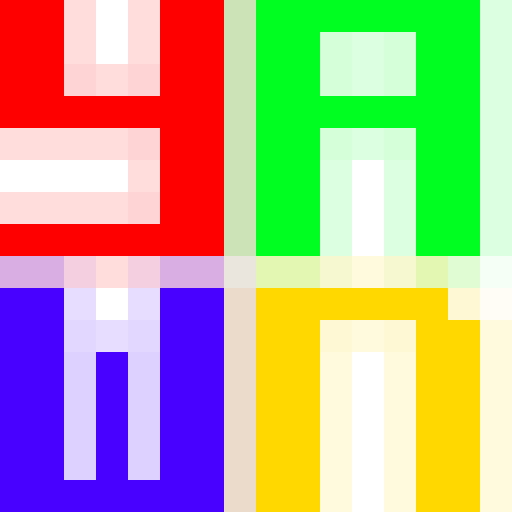
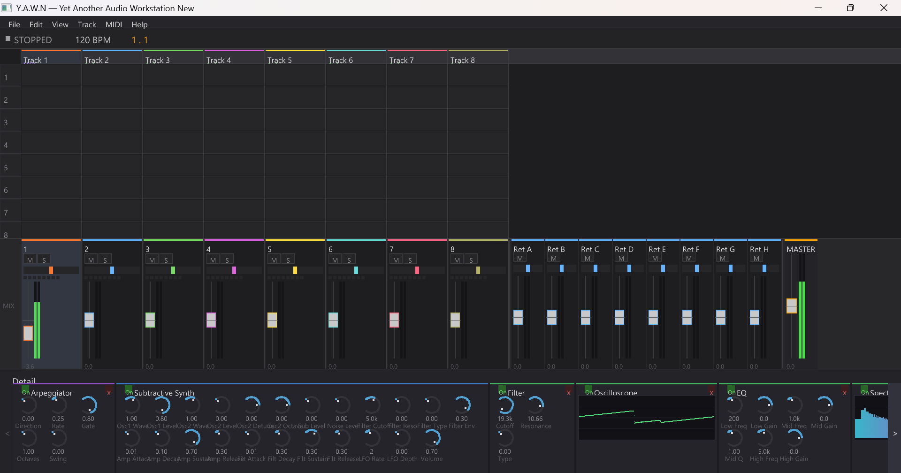

<p align="center">
  
</p>

<h1 align="center">Y.A.W.N</h1>
<h3 align="center">Yetanother Audio Workstation New</h3>

<p align="center">
  A cross-platform digital audio workstation inspired by Ableton Live.<br/>
  Session View · Mixer · Instruments · Effects · MIDI · Clip Launching
</p>

---

## Features

### Audio Engine
- **Real-time Audio Engine** — Lock-free audio thread with PortAudio (ASIO/WASAPI/ALSA)
- **Clip Playback** — Audio files (WAV, FLAC, OGG, AIFF), looping, gain, fade-in/out
- **Quantized Launching** — Launch clips on beat or bar boundaries
- **Transport** — Play/stop, BPM control, beat-synced position tracking
- **Metronome** — Synthesized click track with accent on downbeats, configurable volume & time signature

### Mixer & Routing
- **64-track Mixer** — Per-track volume, pan, mute, solo
- **8 Send/Return Buses** — Pre/post-fader send routing with independent return channels
- **Master Bus** — Master volume with metering
- **3-point Effect Insert** — Effect chains on tracks, return buses, and master

### Native Audio Effects
- **Reverb** — Schroeder/Moorer algorithmic reverb (4 comb + 2 allpass filters)
- **Delay** — Stereo delay with tempo sync, feedback, and ping-pong mode
- **EQ** — 3-band parametric EQ (low shelf, mid peak, high shelf)
- **Compressor** — Dynamics compressor with threshold, ratio, attack, release, makeup gain
- **Filter** — Multi-mode SVF filter (lowpass, highpass, bandpass, notch) with 2x oversampled stability
- **Chorus** — Modulated delay with multiple voices
- **Distortion** — Waveshaper with soft clip, hard clip, and tube saturation modes
- **Oscilloscope** — Real-time waveform visualizer (non-destructive analysis effect)
- **Spectrum Analyzer** — FFT-based frequency spectrum display (non-destructive analysis effect)

### Native Instruments
- **Subtractive Synth** — 2-oscillator analog-style synth with SVF filter, 23 parameters, 16-voice polyphony
- **FM Synth** — 4-operator FM synthesizer with 8 algorithm presets, 19 parameters
- **Sampler** — Sample playback with pitch tracking, linear interpolation, ADSR envelope
- **Instrument Rack** — Multi-chain container with key/velocity zones, per-chain volume/pan (like Ableton Instrument Rack)
- **Drum Rack** — 128 pads mapped to MIDI notes, per-pad sample/volume/pan/pitch adjust

### MIDI
- **MIDI Engine** — Internal 16-bit velocity, 32-bit CC resolution (MIDI 2.0 ready)
- **MIDI I/O** — Hardware MIDI via RtMidi (WinMM/ALSA)
- **MPE Support** — Per-note pitch bend, slide, pressure via zone management
- **7 MIDI Effects** — Arpeggiator (free-running & transport-synced), Chord, Scale, Note Length, Velocity, Random, Pitch

### UI
- **Session View** — Ableton-style clip grid with 8 visible tracks × 8 scenes, scrollable
- **Mixer View** — Channel strips with interactive faders, pan knobs, mute/solo buttons
- **Device Chain Panel** — Full signal-flow device chain (MIDI FX → Instrument → Audio FX) with expandable panels, bypass/remove buttons, horizontal scrolling, color-coded headers
- **Menu Bar** — File, Edit, View, Track, MIDI, Help menus with keyboard accelerators
- **Context Menus** — Right-click track headers to set type, add instruments/effects
- **Confirmation Dialogs** — Modal confirmation when changing track type (Audio ↔ MIDI)
- **Virtual Keyboard** — QWERTY-to-MIDI mapping (Q2W3ER5T6Y7UI9O0P), Z/X octave switching, per-key note tracking
- **Track Selection** — Click to select tracks, highlight in session & mixer views
- **Track Types** — Audio/MIDI type badges, auto-assign SubSynth for new MIDI tracks
- **Targeted Drag & Drop** — Drop audio files onto specific clip slots
- **Custom 2D Renderer** — Batched OpenGL 3.3 rendering with font atlas (stb_truetype)
- **Multi-window Ready** — Built on SDL3 for future detachable panels

### Quality
- **Test-Driven Development** — 293 unit tests via Google Test
- **Zero audio-thread allocations** — All memory preallocated at startup
- **All instruments handle CC 123** (All Notes Off) for clean MIDI effect removal

### Planned

- 🎹 Arrangement View (timeline + piano roll)
- 🔌 VST3 plugin hosting
- 💾 Project save/load (JSON format)

## Screenshots


*Session View showing the clip grid, mixer, and device chain panel with Arpeggiator → Subtractive Synth → Filter → Oscilloscope → EQ → Spectrum Analyzer.*

## Tech Stack

| Component | Technology |
|---|---|
| Language | C++17 |
| UI / Windowing | SDL3 + OpenGL 3.3 |
| Audio I/O | PortAudio |
| MIDI I/O | RtMidi 6.0 |
| Audio Files | libsndfile |
| Font Rendering | stb_truetype |
| Build System | CMake 3.20+ |
| Testing | Google Test 1.14 |
| Platforms | Windows, Linux |

All dependencies are fetched automatically via CMake FetchContent — no manual installs needed.

## Building

### Prerequisites

- **CMake 3.20+**
- **C++17 compiler** — MSVC 2019+ (Windows), GCC 8+ or Clang 8+ (Linux)
- **Python 3 + jinja2** — required by glad2 (OpenGL loader generator)
- **Git** — for FetchContent dependency downloads

```bash
# Install jinja2 if not already present
pip install jinja2
```

### Build

```bash
cmake -B build -DCMAKE_BUILD_TYPE=Release
cmake --build build --config Release
```

### Run

```bash
# Windows
build\bin\Release\YAWN.exe

# Linux
./build/bin/YAWN
```

### Run Tests

```bash
# Windows
build\bin\Release\yawn_tests.exe

# Linux
./build/bin/yawn_tests

# Or via CTest
cd build && ctest --output-on-failure -C Release
```

## Controls

| Key | Action |
|---|---|
| `Space` | Play / Stop |
| `Up` / `Down` | BPM +/- 1 |
| `Home` | Reset position to 0 |
| `M` | Toggle mixer view |
| `D` | Toggle detail panel |
| `Q` `2` `W` `3` `E` `R` ... `P` | Virtual keyboard (MIDI notes) |
| `Z` / `X` | Octave down / up |
| `Esc` | Close menu / Quit |
| **Left click clip** | Launch clip |
| **Right click clip** | Stop track |
| **Click track header** | Select track |
| **Right-click header** | Context menu (type, instruments, effects) |
| **Mouse drag on fader** | Adjust volume |
| **Mouse drag on pan** | Adjust panning |
| **Right-click fader/pan** | Reset to default |
| **Drag & drop audio file** | Load clip into slot under cursor |

## Architecture

```
┌──────────────────────────────────────────────────────────────┐
│                   UI Layer (SDL3 + OpenGL)                   │
│  ┌────────────┐ ┌────────────┐ ┌──────────┐ ┌─────────────┐  │
│  │  Session   │ │   Mixer    │ │ Renderer │ │ Font/Theme  │  │
│  │   View     │ │    View    │ │    2D    │ │             │  │
│  └────────────┘ └────────────┘ └──────────┘ └─────────────┘  │
├──────────────────────────────────────────────────────────────┤
│                   Application Core                           │
│  ┌──────────┐ ┌───────────┐ ┌──────────────────────────────┐ │
│  │ Project  │ │ Transport │ │  Message Queue (lock-free)   │ │
│  │  Model   │ │           │ │  UI ↔ Audio thread           │ │
│  └──────────┘ └───────────┘ └──────────────────────────────┘ │
├──────────────────────────────────────────────────────────────┤
│                   Audio Engine (real-time thread)            │
│  ┌──────────┐ ┌───────────┐ ┌───────────┐ ┌──────────────┐   │
│  │PortAudio │ │   Clip    │ │   MIDI    │ │  Metronome   │   │
│  │ Callback │ │  Engine   │ │  Engine   │ │              │   │
│  └──────────┘ └───────────┘ └───────────┘ └──────────────┘   │
│  ┌──────────┐ ┌───────────┐ ┌───────────┐ ┌──────────────┐   │
│  │  Mixer   │ │  Effects  │ │Instruments│ │ MIDI Effects │   │
│  │ /Router  │ │  Chains   │ │ (Synths)  │ │ (Arp, etc.)  │   │
│  └──────────┘ └───────────┘ └───────────┘ └──────────────┘   │
└──────────────────────────────────────────────────────────────┘
```

**Thread model:** UI thread (SDL main loop) + Audio thread (PortAudio callback). Communication is entirely via lock-free SPSC ring buffers — no mutexes or allocations on the audio thread.

**Audio signal flow:**
```
MIDI Input → MIDI Effect Chain → Instrument → Track Buffer
                                                   ↓
Clip Engine ─────────────────────────────→ Track Buffer (summed)
                                                   ↓
Track Fader/Pan/Mute/Solo → Sends → Return Buses → Master Output
                                                       ↓
                                              Metronome (added)
```

## Project Structure

```
yawn/
├── CMakeLists.txt              # Main build configuration
├── cmake/
│   └── Dependencies.cmake      # FetchContent (SDL3, glad, PortAudio, libsndfile, RtMidi, stb, gtest)
├── src/
│   ├── main.cpp                # Entry point
│   ├── app/
│   │   ├── App.h/cpp           # Application lifecycle, event loop
│   │   └── Project.h           # Track/Scene/Clip grid model
│   ├── audio/
│   │   ├── AudioBuffer.h       # Non-interleaved multi-channel buffer
│   │   ├── AudioEngine.h/cpp   # PortAudio lifecycle, callback, routing
│   │   ├── Clip.h              # Clip data model and play state
│   │   ├── ClipEngine.h/cpp    # Multi-track quantized clip playback
│   │   ├── Metronome.h         # Synthesized click track
│   │   ├── Mixer.h             # 64-track mixer with sends/returns/master
│   │   └── Transport.h         # Play/stop, BPM, position (atomics)
│   ├── core/
│   │   └── Constants.h         # Global limits (tracks, buses, buffer sizes)
│   ├── effects/
│   │   ├── AudioEffect.h       # Effect base class + parameter system
│   │   ├── EffectChain.h       # Ordered chain of up to 8 effects
│   │   ├── Biquad.h            # Biquad filter primitives
│   │   ├── Reverb.h            # Algorithmic reverb
│   │   ├── Delay.h             # Stereo delay with tempo sync
│   │   ├── EQ.h                # 3-band parametric EQ
│   │   ├── Compressor.h        # Dynamics compressor
│   │   ├── Filter.h            # Multi-mode SVF filter
│   │   ├── Chorus.h            # Modulated delay chorus
│   │   ├── Distortion.h        # Waveshaper distortion
│   │   ├── Oscilloscope.h      # Real-time waveform visualizer
│   │   └── SpectrumAnalyzer.h  # FFT-based spectrum display
│   ├── instruments/
│   │   ├── Instrument.h        # Instrument base class
│   │   ├── Envelope.h          # ADSR envelope generator
│   │   ├── Oscillator.h        # polyBLEP oscillator (5 waveforms)
│   │   ├── SubtractiveSynth.h  # 2-osc analog synth + SVF filter
│   │   ├── FMSynth.h           # 4-operator FM synth (8 algorithms)
│   │   ├── Sampler.h           # Sample playback with pitch tracking
│   │   ├── InstrumentRack.h    # Multi-chain container (key/vel zones)
│   │   └── DrumRack.h          # 128-pad drum machine
│   ├── midi/
│   │   ├── MidiTypes.h         # MidiMessage, MidiBuffer, converters
│   │   ├── MidiClip.h          # MIDI clip data model
│   │   ├── MidiPort.h          # Hardware MIDI I/O (RtMidi)
│   │   ├── MidiEngine.h        # MIDI routing and device management
│   │   ├── MidiEffect.h        # MIDI effect base class
│   │   ├── MidiEffectChain.h   # Ordered chain of MIDI effects
│   │   ├── Arpeggiator.h       # Beat-synced arpeggiator (6 modes)
│   │   ├── Chord.h             # Parallel interval generator
│   │   ├── Scale.h             # Note quantization (9 scale types)
│   │   ├── NoteLength.h        # Forced note duration
│   │   ├── VelocityEffect.h    # Velocity curve remapping
│   │   ├── MidiRandom.h        # Pitch/velocity/timing randomization
│   │   └── MidiPitch.h         # Transpose by semitones/octaves
│   ├── ui/
│   │   ├── Font.h/cpp          # stb_truetype font atlas
│   │   ├── Renderer.h/cpp      # Batched 2D OpenGL renderer
│   │   ├── SessionView.h/cpp   # Clip grid, transport bar, waveforms
│   │   ├── MixerView.h/cpp     # Interactive mixer channel strips
│   │   ├── DetailPanel.h       # Device chain panel (signal-flow order)
│   │   ├── ConfirmDialog.h    # Modal confirmation dialog
│   │   ├── MenuBar.h           # Application menu bar
│   │   ├── ContextMenu.h       # Right-click popup menus with submenus
│   │   ├── VirtualKeyboard.h   # QWERTY-to-MIDI keyboard
│   │   ├── Widget.h            # Base widget with input state tracking
│   │   ├── Theme.h             # Ableton-dark color scheme
│   │   └── Window.h/cpp        # SDL3 + OpenGL window wrapper
│   └── util/
│       ├── FileIO.h/cpp        # Audio file loading (libsndfile)
│       ├── MessageQueue.h      # Typed command/event variants
│       └── RingBuffer.h        # Lock-free SPSC ring buffer
├── tests/                      # 293 unit tests (Google Test)
│   ├── CMakeLists.txt
│   ├── test_AudioBuffer.cpp
│   ├── test_Clip.cpp
│   ├── test_ClipEngine.cpp
│   ├── test_DetailPanel.cpp    # Device chain panel tests (10 tests)
│   ├── test_Effects.cpp        # Audio effect tests (29 tests)
│   ├── test_FileIO.cpp
│   ├── test_Instruments.cpp    # Instrument tests (32 tests)
│   ├── test_MessageQueue.cpp
│   ├── test_Metronome.cpp      # Metronome tests (9 tests)
│   ├── test_MidiEffects.cpp    # MIDI effect tests (27 tests)
│   ├── test_MidiEngine.cpp
│   ├── test_Project.cpp
│   ├── test_RingBuffer.cpp
│   └── test_Transport.cpp
└── assets/                     # Runtime assets (copied to build dir)
```

## Implementation Phases

| Phase | Status | Description |
|---|---|---|
| 1. Project Scaffolding | ✅ Done | CMake build system, SDL3+OpenGL window, directory structure |
| 2. Audio Engine | ✅ Done | PortAudio callback, transport, lock-free ring buffers |
| 3. Clip Playback | ✅ Done | libsndfile loading, quantized clip launching, looping |
| 4. Session View UI | ✅ Done | Clip grid, transport bar, waveform thumbnails, theme |
| 5. Mixer & Routing | ✅ Done | 64-track mixer, 8 send/return buses, master, metering |
| 6. MIDI Engine | ✅ Done | MIDI 2.0-res internals, RtMidi I/O, MPE zones, MIDI clips |
| 7. Metronome | ✅ Done | Synthesized click track, beat-synced, configurable |
| 8. Audio Effects | ✅ Done | 9 built-in effects (+ 2 visualizers), effect chains, 3-point insert |
| 9. Native Instruments | ✅ Done | 5 instruments (SubSynth, FM, Sampler, InstrumentRack, DrumRack) |
| 10. MIDI Effects | ✅ Done | 7 MIDI effects (Arp, Chord, Scale, NoteLength, Velocity, Random, Pitch) |
| 11. Interactive UI | ✅ Done | Widget system, menu bar, mixer controls, detail panel, virtual keyboard, context menus |
| 12. Arrangement View | 🔲 Next | Timeline, clip placement, piano roll editor |
| 13. VST3 Hosting | 🔲 Planned | VST3 SDK, plugin scanning, editor windows |
| 14. Save/Load & Polish | 🔲 Planned | JSON project files, undo/redo, keyboard shortcuts |

### Phase 12: Arrangement View (Next)

The Arrangement View provides a linear timeline for composing full tracks:

- **Timeline grid** — Beat/bar grid with zoom and scroll (horizontal time, vertical tracks)
- **Clip placement** — Drag audio and MIDI clips onto timeline tracks
- **Playhead** — Rendering and scrubbing with transport integration
- **MIDI Piano Roll** — Note editing within MIDI clips (velocity, duration, pitch)
- **Recording** — Record from Session View clips to Arrangement
- **Automation lanes** — Per-track parameter automation (volume, pan, effect params)

### Phase 13: VST3 Plugin Hosting

Full VST3 plugin support for third-party effects and instruments:

- **VST3 SDK integration** — Compile and link the official Steinberg VST3 SDK
- **Plugin scanning** — Discover VST3 plugins in standard system paths
- **Audio effects** — Load VST3 effects into track/return/master effect chains
- **Instruments** — Load VST3 instruments as MIDI track sound generators
- **Plugin editor windows** — Embed native plugin GUIs in secondary SDL3 windows
- **Parameter mapping** — Generic knob grid for plugins without custom GUIs
- **Preset management** — Save/load plugin state with project

### Phase 14: Project Save/Load & Polish

Final polish to make Y.A.W.N a usable production tool:

- **JSON project format** — `.yawn` files referencing audio assets and plugin state
- **Audio asset management** — Copy-to-project or external reference modes
- **Undo/redo** — Command pattern for all user actions
- **Keyboard shortcuts** — Comprehensive shortcuts for all operations
- **MIDI file import/export** — Standard MIDI file support
- **Audio export** — Offline render to WAV/FLAC
- **Drag & drop** — Audio files, MIDI files, plugins between tracks
- **Preferences** — Audio device selection, buffer size, sample rate, MIDI device config

## License

[MIT](LICENSE.txt) © Tasos Kleisas
