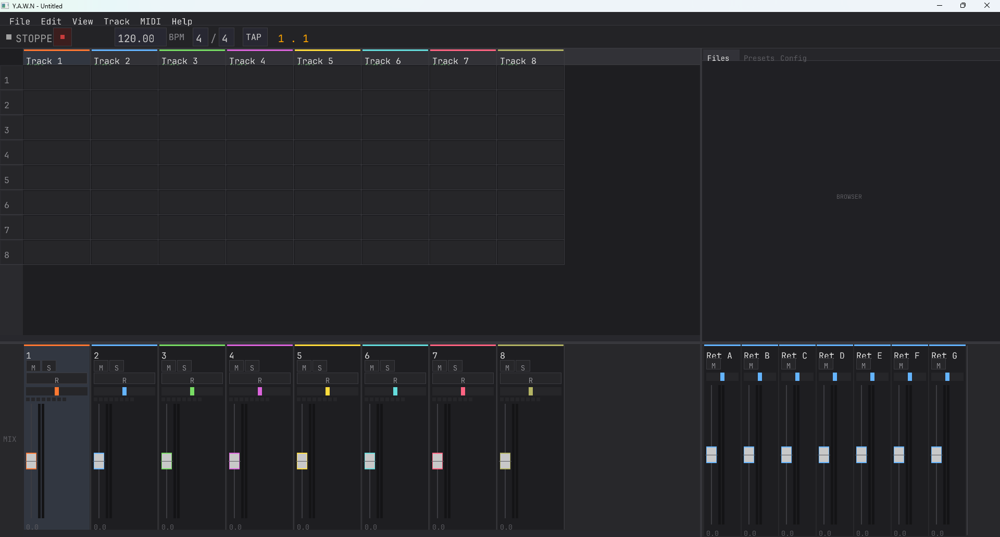
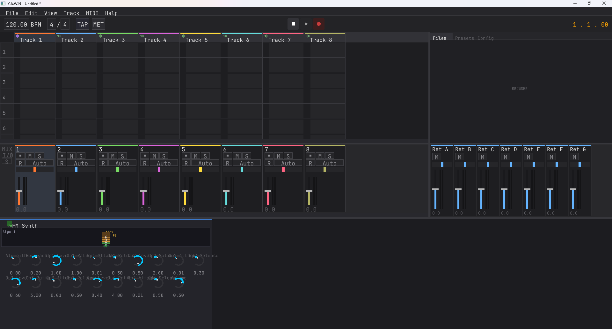
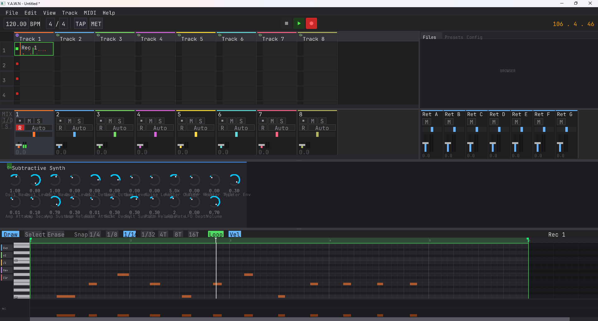

<p align="center">
  
</p>

<h1 align="center">Y.A.W.N</h1>
<h3 align="center">Yetanother Audio Workstation New</h3>

<p align="center">
  A cross-platform digital audio workstation inspired by Ableton Live.<br/>
  Session View · Arrangement · Mixer · VST3 · Instruments · Effects · MIDI · Recording · Automation · Presets · <strong>Ableton Link</strong> · Controller Scripting (Push 1 + Move + nanoKONTROL2 + Reface DX) · <strong>Visual / VJ Engine · Video Clips · 3D Models</strong><br/><br/>
  <em>Made with AI-Sloptronic™ technology</em><br/>
  <sub>Where "it compiles" is the new "it works", every bug is a ✨feature request✨, and every feature request is a ✨pre-existing bug✨</sub>
</p>

---

> **⚠️ Disclaimer:** No human engineers were mass-employed in the making of this software.
> The entire codebase was produced through the ancient art of describing what you want to a machine
> and then spending twice as long explaining why that's not what you meant.
> Side effects may include: spontaneous filter resonance, existential questions about who actually wrote this,
> and an unshakeable feeling that the AI is just gaslighting you into thinking the bug is fixed.
>
> **⚠️ VST3 Disclaimer:** We have successfully taught an AI to host third-party plugins inside a DAW
> that was itself written by an AI. This is either the future of music production or the opening scene
> of a techno-horror film. The VST3 editors run in a separate process because JUCE plugins install
> Win32 hooks that freeze our event loop — a bug we diagnosed after 3 hours of "why is the window frozen"
> followed by the AI saying "Ah, I see the issue!" for the 47th time.
>
> **⚠️ Ableton Link Disclaimer:** YAWN is now ABLE-TO-N (sync). Press Play in Live and YAWN follows.
> Press Play in YAWN and Live follows. Two AI-written DAWs and one AI-written DAW are now phase-locked
> over your LAN. We're not saying this is how Skynet starts but we're not NOT saying it.
>
> **⚠️ UI Framework Disclaimer:** We had two UI frameworks for a while. They lived next to each other
> in `framework/` and `framework/v2/`, communicated through a 766-line bridge layer, and stomped on
> each other's mouse capture so often we had to add a runtime guard that yells at you when it happens.
> They are now one framework, in three commits, totalling −2,960 lines. The build is faster. The dispatch
> chain is shorter. The dials turn. *Probably.*
>
> **⚠️ Neural Amp Disclaimer:** YAWN now hosts WaveNet-style guitar amp captures inline via Neural Amp
> Modeler. The first model loaded fine. The second model loaded fine. The third model use-after-freed
> the audio thread on a freed `nam::DSP*` because the loader was destroying it from the UI thread
> mid-`process()`. The fix is RCU-lite atomic pointer swap with a retired-list and deferred destruction
> on the next load. We then wrote the same trick into Convolution Reverb because it had the same race
> waiting to bite. Then MSVC silently dead-stripped `nam::get_dsp` so the device shipped showing "idle"
> with the model path stored, fixed by `$<LINK_LIBRARY:WHOLE_ARCHIVE,nam>` (cost: 6 MB binary, benefit:
> the device actually does anything). All this so a guitarist can drop a `.nam` on a track and get a
> Mesa Boogie sound out of a DAW the AI wrote without ever having played a guitar.

## Features

### Audio Engine
- **Real-time Audio Engine** — Lock-free audio thread with PortAudio (ASIO/WASAPI/ALSA), zero audio-thread allocations. The AI wrote it without being able to hear audio. We're not sure if that's a superpower or a disability.
- **Clip Playback** — Audio files (WAV, FLAC, OGG, AIFF, MP3), looping, gain, fade-in/out
- **Quantized Launching** — Launch clips on beat or bar boundaries with configurable quantize resolution (Next Bar, Next Beat, Immediate, 1/2, 1/4, 1/8, 1/16)
- **Transport** — Play/stop/record, BPM control, beat-synced position tracking, loop range with draggable markers
- **Ableton Link** — Network beat/tempo sync over LAN, automatic peer discovery, drift-free phase alignment. Plays nicely with Live, Logic, Bitwig, Reason, iOS apps — anything that speaks Link. Local UI tempo edits (typing into the BPM box, encoder turns) are gated through a `localTempoChanged` flag so the next audio buffer doesn't clobber your input by reading back the stale session tempo (race condition we found, fixed, and wrote a regression test for — once)
- **Metronome** — Synthesized click track with accent on downbeats, configurable volume & time signature, count-in (0/1/2/4 bars), mode selection (Always/Record Only/Play Only/Off)
- **Follow Actions** — 8 action types (Next, Previous, First, Last, Random, Any, Play Again, Stop), dual-action with probability (A/B chance), bar-count trigger duration
- **Time Stretching** — WSOLA (rhythmic/percussive) and Phase Vocoder (tonal/texture) algorithms, per-track speed ratio (0.25×–4×), 6 warp modes (Off/Auto/Beats/Tones/Texture/Repitch)
- **Transient Detection** — Adaptive threshold onset detection with BPM estimation, configurable sensitivity
- **Warp Markers** — Map original audio positions to target beat positions for flexible time-stretching

### Mixer & Routing
- **64-track Mixer** — Per-track volume, pan, mute, solo with peak metering. The AI mixed a song once. It sounded like a spreadsheet.
- **8 Send/Return Buses** — Pre/post-fader send routing with independent return channels
- **Master Bus** — Master volume with stereo metering
- **3-point Effect Insert** — Effect chains on tracks, return buses, and master
- **Audio Input Routing** — Per-track audio input channel selection, monitor modes (Auto/In/Off)
- **MIDI Routing** — Per-track MIDI input port/channel, output port/channel

### Recording
- **Audio Recording** — Per-track audio input recording with arm/disarm, overdub mode, multi-channel capture
- **MIDI Recording** — Record from hardware MIDI keyboards with note/CC capture, proper finalization on transport stop
- **Record Quantize** — Configurable quantize on record (None, Next Beat, Next Bar)
- **Count-in** — 0, 1, 2, or 4 bar count-in before recording starts

### Integrated Audio Effects

*19 hand-crafted artisanal effects, each lovingly hallucinated by an AI that has never used a compressor but has read 47 papers about them. We doubled the count in one batch and the AI is now insufferable about it.*

- **Reverb** — Schroeder/Moorer algorithmic reverb (4 comb + 2 allpass filters)
- **Delay** — Stereo delay with tempo sync, feedback, and ping-pong mode
- **Ping-Pong Delay** — Dedicated stereo bouncer with independent L/R times, explicit cross-feedback knob (vs. the original Delay's binary on/off ping-pong), width control over the dry-input split, per-side LP in the feedback path. Forked because tempo-synced 1/4-dotted-on-L + 1/8-on-R wants two Time knobs, not a workaround
- **EQ** — 3-band parametric EQ (low shelf, mid peak, high shelf)
- **Spline EQ** — 8-node parametric EQ with a custom drag-edit display panel: dual pre/post spectrum analyser overlay, RBJ-cookbook biquad response curve drawn through the cascaded filters, drag a node to set freq+gain, scroll-wheel or shift-drag for Q, click empty area to drop a new node (auto-grabs into a drag), right-click cycles type, double-click deletes. Per-node hover readout shows freq / gain / Q. The 40 underlying params remain settable via automation / preset / MIDI Learn — the panel just is the editor
- **Compressor** — Dynamics compressor with threshold, ratio, attack, release, makeup gain
- **Filter** — Multi-mode SVF filter (lowpass, highpass, bandpass, notch) with 2× oversampled stability
- **Chorus** — Modulated delay with multiple voices
- **Distortion** — Waveshaper with soft clip, hard clip, and tube saturation modes
- **Bitcrusher** — Bit-depth quantization (1–16) + zero-order-hold sample-rate decimation (100 Hz – 48 kHz) + optional anti-alias pre-filter + TPDF dither toggle + dry/wet. Mid-tread quantizer so low bit depths don't add DC; aliasing is part of the sound, not a bug
- **Noise Gate** — Full expander/gate with hysteresis (open ≥ close threshold), attack / hold / release state machine, 0–10 ms lookahead (audio path is delayed; detection reads the un-delayed input so fast attacks don't clip transients), sidechain detection toggle, ducking polarity-invert mode (close when sidechain is hot — classic "kick ducks pad" pump)
- **Envelope Follower** — Audio level → control signal, optionally driving a built-in LP/HP/BP filter on the audio path (auto-wah). Sidechain input (Input/SC source toggle), Peak / RMS detection, asymmetric attack/release, depth in semitones-of-cutoff-offset, range up to 6 octaves. Doubles as a routable modulation source via `AudioEffect::hasModulationOutput / modulationValue` + an atomic `consumeEnvelope()` for cross-thread reads — set Filter Type = Off and the device exists purely to publish the envelope value for visual params or modulation depths elsewhere
- **Convolution Reverb** — IR-based reverb via uniformly-partitioned FFT block convolution — 10s max IR @ host rate, ~30 MFLOP/s vs ~11 GFLOP/s direct convolution; one-block latency from sub-block buffering, inaudible for reverb. Pre-delay 0–200 ms, low-cut + high-cut on the wet path, IR gain trim, mix. Loader handles `.wav / .flac / .aif / .aiff / .ogg / .mp3` with auto-resample to host rate (a 44.1 kHz IR on a 48 kHz host would otherwise play 9 % low and short — easy to miss). RCU-lite atomic-engine-swap on IR load (audio thread acquire-loads a stable engine pointer per block; old engines park in a retired list and destruct on the NEXT load) so reloading IRs while audio is rolling can't use-after-free. Ships with **38 bundled Voxengo reverb IRs** so the device is usable on first install — file dialog opens at the bundled folder, license + attribution in `NOTICES.md`
- **Neural Amp** — [Neural Amp Modeler](https://github.com/sdatkinson/NeuralAmpModelerCore) (`.nam`) inference effect with input gain / output gain / mix. NeuralAmpModelerCore + Eigen vendored via `FetchContent`, built as a C++20 static lib while the rest of YAWN stays C++17 — a PIMPL split keeps the C++20 NAM headers contained to a single TU. Linker forced to `WHOLE_ARCHIVE` because MSVC's function-level DCE was silently stripping `nam::get_dsp` (cost: ~6 MB binary, benefit: the device actually does anything). Same RCU-lite atomic-DSP-swap as Conv Reverb so loading models while audio plays doesn't crash on the third load. Bundled 4 community NAM amp captures (Clean / Crunch / High-gain / Bass) from `pelennor2170/NAM_models` under GPL v3 with capturer attribution preserved in filenames; load any other `.nam` from `tonehunt.org` / `tone3000.com`
- **Tape Emulation** — Analog tape simulation with asymmetric saturation, wow/flutter, tape hiss, and tone rolloff
- **Amp Simulator** — Guitar/bass amp modelling with 4 amp types (Clean/Crunch/Lead/High Gain), 3-band tone stack, cabinet simulation
- **Tuner** — YIN pitch detection with frequency/cents/note display, reference pitch control (420–460 Hz), confidence indicator
- **Oscilloscope** — Real-time waveform visualizer (non-destructive analysis effect)
- **Spectrum Analyzer** — FFT-based frequency spectrum display (non-destructive analysis effect)

#### Sidechain + modulation routing for effects

`AudioEffect` carries the same `setSidechainInput(buffer)` / `supportsSidechain()` plumbing as `Instrument` — `AudioEngine` fans the per-track sidechain pointer (set via `SetSidechainSourceMsg`, sentinel `-2` = live audio interface input, `-1` = none, `0..N-1` = source track) to BOTH the instrument AND every effect on the same track. So a Noise Gate, Envelope Follower, or future sidechain-aware compressor on track B can react to track A's audio without per-effect routing UI.

`AudioEffect::hasModulationOutput()` + `modulationValue()` mirror the existing LFO MidiEffect modulation source pattern on the audio side. Envelope Follower advertises both this and an atomic `consumeEnvelope()` accessor so the visual engine, knob displays, and any other UI/automation consumer can subscribe to the live envelope value without touching the audio thread.

`AudioEffect::saveExtraState() / loadExtraState()` parallel `Instrument`'s preset-extra-state hooks. Conv Reverb persists the IR file path across project save/load and **rehydrates the actual sample data on project open** — `App::rehydrateConvolutionIRs` walks every effect chain after `syncTracksToEngine` and re-reads any IR file referenced in extraState. Same hook is wired for NeuralAmp's `.nam` path.

### VST3 Plugin Hosting

*The AI built a plugin host before learning what a plugin sounds like. It correctly implemented the entire VST3 COM interface on the first try. We're terrified.*

- **Plugin Scanning** — Automatic discovery in standard system paths: Windows (Program Files/Common Files/VST3, user LocalAppData/Programs/Common/VST3) and Linux (`/usr/lib/vst3`, `/usr/local/lib/vst3`, `~/.vst3`) — class enumeration with vendor/category info
- **VST3 Instruments** — Load third-party VST3 synths as track instruments with full parameter automation
- **VST3 Audio Effects** — Load VST3 effects in any effect chain slot (track, return, master)
- **Process-Isolated Editor** — Plugin GUIs run in a separate process (`yawn_vst3_host`) via bidirectional IPC. On Windows this dodges JUCE plugins' process-wide Win32 message hooks that would freeze our event loop; on Linux the child embeds the plugin via X11 (`kPlatformTypeX11EmbedWindowID`) and runs a full `Steinberg::Linux::IRunLoop` with FD + timer dispatch so plugins like Surge XT render and animate correctly
- **Parameter Sync** — Full bidirectional parameter sync between host and editor process
- **State Persistence** — Processor + controller state serialized with project (hex-encoded binary)
- **Generic Knob Grid** — Automatic parameter knob UI for plugins without custom editors

### Integrated Instruments
- **Subtractive Synth** — 2-oscillator analog-style synth with SVF filter, 23 parameters, 16-voice polyphony
- **FM Synth** — 4-operator FM synthesizer with 8 algorithm presets, 19 parameters
- **Sampler** — Sample playback with pitch tracking, linear interpolation, ADSR envelope
- **Karplus-Strong** — Physical modelling string synth with 4 exciter types, damping, body resonance, string stretch
- **Wavetable Synth** — 5 algorithmic wavetable types with position morphing, SVF filter, LFO modulation, sub oscillator, unison
- **Granular Synth** — Sample-based granular synthesis with 4 window shapes, position/spread/spray, scan, pitch jitter, stereo width
- **Vocoder** — Band-based vocoder with 4 carrier types (Saw/Square/Pulse/Noise), 4–32 bands, envelope followers, formant shift
- **Multisampler** — Multi-zone sample player with key/velocity mapping, per-zone tuning/volume/pan/loop, velocity crossfade, dual ADSR, zone-list + per-zone editor UI. Build instruments in minutes via the integrated [Auto-Sampler](#auto-sampler) — no VB-CABLE, no Stereo Mix, no third-party tools
- **Instrument Rack** — Multi-chain container (up to 8 chains) with key/velocity zones, per-chain volume/pan, chain enable/disable toggle, visual zone bars, add/remove chain UI
- **Drum Rack** — 128 pads with 4×4 grid display, 8-page navigation, per-pad sample loading via drag & drop, per-pad volume/pan/pitch knobs, waveform preview, playing/sample indicators
- **DrumSlop** — Loop slicer drum machine: auto/even/manual slicing, 16 pads with ADSR, SVF filter, per-pad effect chains, configurable MIDI base note
- **Drum Synth** — Fully-synthesised 8-piece kit (Kick / Snare / Clap / Tom 1 / CHH / OHH / Tom 2 / Tamb), GM-mapped MIDI notes (C1 / D1 / E1 / F1 / F#1 / A#1 / G1 / G#1), per-drum DSP (sine + pitch sweep + click for the kick; metallic-ratio square sums for hats; tuned noise + envelope for snare/clap/toms; etc.), per-drum tune / decay / volume / pan, CHH/OHH choke group, sample-free so it travels anywhere the project does. Companion to Drum Rack for users who want a tweakable kit without managing samples

### Auto-Sampler

*Build a Multisampler instrument from any MIDI source — hardware synth, soft synth, VST3 plugin, the GS Wavetable Synth Windows ships with — by sweeping a note grid, capturing the audio response, and slicing the keymap automatically. The AI taught itself how to auto-sample a synth before learning what a synth was. Then it wrote a tuner. The numbers were wrong, the AI said "Ah, I see the issue!" 14 times, and now they're right.*

- **MIDI grid drive** — Sweep a (note × velocity-layer) matrix through any open MIDI output. Defaults: C2–C7, every major-third, **4 velocity layers** (matches Logic Sampler Auto / Redmatica / SampleRobot defaults), 2.0 s note hold + 1.5 s release tail
- **Lock-free private capture** — Per-note recording via a SPSC side-channel on the audio engine, independent of transport / clip / track recording. Captures interleaved float WAVs at the engine's running sample rate
- **WASAPI loopback (Windows)** — Capture system playback **without** VB-CABLE, Voicemeeter, or Stereo Mix. Every Windows playback endpoint shows up in YAWN's input device dropdown as `[loopback]`; pick one, point your synth at the same output, done. Stream rate is auto-negotiated against the device's mix format (typically 48 kHz) and every rate-cached subsystem (instruments, effects, transport, clip engines) is re-pinned to `Pa_GetStreamInfo()`'s truth so a 44.1 ↔ 48 kHz step doesn't pitch the whole engine 147 cents off (a bug we found, fixed, and have a story about)
- **Test Note button** — Toggles a sustained C4 v100 over the chosen MIDI port. Live **VU meter** shows input peak with the user-set **Level knob** (–24 dB to +24 dB) baked in — what you see in the meter is what hits disk, so you dial gain against the meter and ride the loudest preset just below 0 dBFS
- **Per-note silence trim** — Configurable threshold (default −60 dBFS) trims dead air at the start of each capture; preserves the attack with a 10 ms safety margin
- **Auto zone slicing** — Key ranges split at midpoints between adjacent root notes; velocity ranges split at midpoints between adjacent layers. Playback covers the whole keyboard seamlessly across zones
- **Folder layout** — `<project>.yawn/samples/<sanitized_capture_name>/<root>_v<vel>.wav` plus a `manifest.json` describing the run. Default capture name is derived from the track name (`midi_1_capture`, `piano_capture`, etc.) and sanitized to filename-safe form

#### Workflow

1. Add a Multisampler to a track (or pick one)
2. Click **Auto-Sample…** in the device's display panel
3. Pick MIDI port + channel, audio input + mono/stereo, note range + step, velocity layer count, note-length / release-tail timing
4. Hit **Test Note** — verify the synth speaks and the VU meter swings; dial the **Level** knob until the loudest preset peaks just below 0 dBFS
5. **Capture** → progress bar + live "Now: C4 vel 100" status, ~3–4 minutes for a default 64-sample run
6. Done → zones populate the Multisampler, project marks dirty, samples + manifest land in the project's `samples/` folder. Save the project to keep them

#### Saving a preset

- **Save Preset…** on the Multisampler captures the full instrument: 14 global params (Amp ADSR / Filter / Filt Env / Glide / Vel Crossfade / Volume) **plus** every zone's audio + keymap (root, key range, vel range, tune, vol, pan, loop). Per-zone WAVs are written to `<presets>/multisampler/<preset>/zone_NN.wav` with `sampleRate` stamped into the JSON so playback compensates for engine-rate changes
- **Project-local mirror** — When a project is open, every Save Preset writes a copy into `<project>.yawn/presets/multisampler/` so the project folder is self-contained for sharing / archiving. The preset menu unions both lists (project-local wins on name collision)
- The Browser's Presets tab refreshes on every save (no app-restart required)

### MIDI
- **MIDI Engine** — Internal 16-bit velocity, 32-bit CC resolution (MIDI 2.0 ready)
- **MIDI I/O** — Hardware MIDI via RtMidi (WinMM/ALSA), multi-port input/output
- **MPE Support** — Per-note pitch bend, slide, pressure via zone management
- **8 MIDI Effects** — Arpeggiator (free-running & transport-synced), Chord, Scale, Note Length, Velocity, Random, Pitch, LFO
- **MIDI Learn** — Map any CC or Note to any parameter (instrument, effect, mixer, transport), learn mode with visual feedback, per-channel or omni, JSON persistence
- **MIDI Monitor** — Lock-free 65K-event ring buffer tracking all message types (Note, CC, PitchBend, Pressure, Clock, SysEx), port identification, millisecond timestamps

### Automation & Modulation
- **Automation Engine** — Per-parameter breakpoint envelopes with Read/Touch/Latch modes
- **Track Automation** — Automation lanes in arrangement view with click to add/drag/right-click delete breakpoints
- **Clip Automation** — Per-clip automation lanes (relative to clip start, loops with clip)
- **Automation Recording** — Touch/Latch parameter recording from UI knob interaction
- **LFO Device** — Per-track LFO with 5 waveforms (sine, triangle, saw, square, S&H), tempo sync, depth, phase, polarity
- **LFO Linking** — Stable ID-based linking to any instrument/effect/mixer parameter across tracks, survives reordering
- **Automation Targets** — Instrument params, audio effect params, MIDI effect params, mixer (volume, pan, sends)

### Session View
- **Clip Grid** — 8 visible tracks × 8 scenes, scrollable, clip launching with quantized triggers
- **Scene Management** — Insert, duplicate, delete scenes with undo support, automatic renumbering
- **Scene Launching** — Click scene label to launch all clips in a scene simultaneously
- **Follow Actions** — Per-clip chained actions with dual-action probability
- **Track Management** — Add, delete tracks with confirmation dialog (stops engine, shifts all arrays)
- **Context Menus** — Right-click track headers for type/instruments/effects, right-click scenes for insert/duplicate/delete, right-click clips for stop

### Arrangement View
- **Timeline Grid** — Horizontal beat/bar grid with zoom (4–120 px/beat), scroll, snap-to-grid (off/bar/beat/half/quarter/eighth)
- **Clip Placement** — Click to select, drag body to move (same + cross-track), drag edges to resize, double-click to create, Ctrl+D to duplicate, Delete to remove
- **Arrangement Playback Engine** — Per-track clip rendering (audio + MIDI) with fade-in/out, thread-safe clip submission
- **Session/Arrangement Toggle** — Per-track S/A button, auto-activates on view switch when clips exist
- **Automation Lanes** — Expandable per-track lanes showing breakpoint envelopes, visual curve rendering
- **Loop Range** — Green markers in ruler, Shift+click to set, drag to adjust, L key to toggle
- **Auto-Scroll** — Playhead stays visible during playback (F key to toggle)
- **Waveform Display** — Audio clip waveform rendering in arrangement blocks

### Project Management
- **Project Save/Load** — JSON-based `.yawn` format with full round-trip serialization
- **Serialized State** — Tracks, scenes, clip grid, instruments, effects, MIDI effects, mixer state, automation, arrangement clips, MIDI Learn mappings
- **Sample Management** — Referenced audio samples copied to project folder
- **Audio Export** — Offline render to WAV/FLAC/OGG with bit depth (Int16/Int24/Float32) and sample rate selection, scope (full arrangement or loop region), progress tracking with cancellation
- **Undo/Redo** — Full undo/redo system with action merging (Ctrl+Z / Ctrl+Y)

### UI Framework

*Originally written as a v1 widget library. Then a v2 widget library was written next to it because the AI got bored. Then we lived with both for a while because nobody wanted to deal with it. Then we deleted the v1 library in three commits totalling −2960 lines and pretended we'd planned it that way the whole time.*

- **Single fw2 framework** — One `Widget` base class, one event type per kind, one global `capturedWidget()` slot, one `dispatchMouseDown` walking the tree. Used to be two of each running side-by-side via 766 lines of bridge wrappers. The bridge wrappers are gone. The capture-stomp class of bug is structurally impossible (only one capture slot to stomp now).
- **Cached two-pass layout** — Measure / layout pipeline with a global epoch + per-widget local-version cache. Re-layout of a stable tree is near-free; widgets opt out of the auto-relayout-boundary heuristic when their measured size depends on their children (which is most containers, as it turns out)
- **Hardening guards** — `Widget::captureMouse` warns + asserts when an own-dispatch container takes capture while a descendant of its own subtree already holds it (the recurring "dial doesn't turn" trap). MSVC `/we4717` (always-recursive function) is now a compile error after a stack-overflow took 3 hours to diagnose because we'd been ignoring the warning. `/we4715`, `/we4716`, `/we4172`, `/we4533`, `/we4701` likewise; gcc/clang counterparts via `-Werror=infinite-recursion` etc.
- **FlexBox** — Row/column layout container with stretch/flex/fixed size policies, gap, justify, align. Walks children for mouse dispatch (no children-walking-on-rails framework code; container widgets explicitly route)
- **ContentGrid** — 4-quadrant container with draggable horizontal + vertical dividers, used for the session/mixer/browser/return-master split
- **Session Panel** — Ableton-style clip grid with scrollable tracks and scenes
- **Arrangement Panel** — Horizontal timeline with track headers, clip blocks, automation lanes, ruler, playhead, loop markers
- **Mixer Panel** — Channel strips with interactive faders, pan knobs, mute/solo buttons, peak metering
- **Device Chain Panel** — Composite widget architecture: DeviceWidget (header + grid + knobs + visualizer), SnapScrollContainer, neon arc knobs with 24-segment rendering
- **Grouped Instrument Layouts** — Instruments display knobs in logical sections (Global, Op 1–4, Filter, Amp, etc.) with inline graphical displays instead of flat grids
- **Instrument Display Widgets** — FM algorithm routing diagram, ADSR envelope curves, oscillator waveform previews, filter response curves, composite synth panels
- **Visual Params Panel** — Per-track visual-knob and shader-chain editor that docks at the bottom of the screen for visual tracks (replacing the audio detail panel)
- **Waveform Widget** — Interactive waveform display with zoom/scroll, overview bar, playhead tracking, transient markers, warp marker editing (create/drag/delete), loop region overlay
- **Piano Roll Editor** — MIDI note editing with draw/select/erase tools, zoom/scroll, velocity, snap-to-grid, follow-playhead mode, clip operations (duplicate, double, halve, reverse, clear, set 1.1.1 here)
- **Layer Stack** — Floating-overlay layer system for modal dialogs, dropdowns, context menus, tooltips, and toasts. Overlays sit above the main widget tree and intercept events with proper outside-click-dismiss semantics
- **Export Dialog** — Format/bit depth/sample rate selectors, scope selection, progress bar with cancellation
- **Preferences Dialog** — Audio devices, MIDI ports, default quantize, metronome settings, font scale, Ableton Link enable
- **Primitive Widgets** — FwButton, FwToggle, FwKnob (with double-click text entry, step snapping, format callbacks, unit-aware edit buffer), FwFader, FwPan, FwMeter, Label, FwTextInput, FwNumberInput, FwDropDown, FwScrollbar, all with hover animations and gesture state machines
- **Dialog System** — fw2 `Dialog` / `ConfirmDialog` / `FwTextInputDialog` / `FwExportDialog` / `FwPreferencesDialog` on the modal layer with title bar, OK/Cancel, drag-to-move, Escape/Enter handling
- **Context Menus** — fw2::ContextMenu with submenus, keyboard navigation, separators, headers, checkable + radio rows. Right-click track headers, scene labels, clips, transport buttons, knobs (for MIDI Learn), visual clips, etc.
- **Menu Bar** — File, Edit, View, Track, Scene, MIDI, Help menus with keyboard accelerators (auto-detected from menu items — type `D` and the panel toggles)
- **DPI Scaling** — Auto-detect display scale (SDL3), user override, scaled() helper for all layout constants. Theme epoch bump invalidates every widget's measure cache atomically when font-size or DPI changes
- **Panel Animations** — Smooth exponential-lerp height transitions on panel collapse/expand. Animation lives in a per-frame `tick()` method (not in `onMeasure`, because a measure cache makes "call measure 60 times to converge" silently broken — found out the hard way)
- **Toast Notifications** — Top-center status banner with replace-latest semantics, severity accent (info/warn/error), 1.5 s hold + 200 ms fade. Thread-safe; fired from controller scripts (`yawn.toast(...)`), project save/load, video import, and other async events. Designed partly as a screen substitute for controllers without their own display (e.g. Ableton Move, nanoKONTROL2, Reface DX)
- **Tooltip Manager** — Hover-tracked tooltips with delay + viewport-edge clamping
- **Virtual Keyboard** — QWERTY-to-MIDI mapping (Q2W3ER5T6Y7UI9O0P), Z/X octave switching, per-key note tracking. Yields number keys to text-input edits so typing a knob value doesn't accidentally play notes
- **Track Selection** — Click to select tracks, highlight in session & mixer views
- **Track Type Icons** — Waveform icon for audio tracks, DIN circle icon for MIDI tracks, monitor icon for visual tracks
- **Targeted Drag & Drop** — Drop audio files onto specific clip slots; drop video files onto visual tracks; drop samples onto Sampler/DrumRack/Granular
- **Custom 2D Renderer** — Batched OpenGL 3.3 rendering with font atlas (stb_truetype), texture atlas, scissor-stack clipping
- **Crash Handler** — Signal handlers (SIGSEGV, SIGABRT, SIGFPE, SIGILL) with stack traces (Windows: SymFromAddr + dbghelp, Unix: backtrace + addr2line), crash log appended to `yawn.log`
- **Multi-window Ready** — Built on SDL3 for the visual output window (and future detachable panels)

### Controller Scripting

*The AI embedded a scripting engine inside a DAW it wrote, so you can control the DAW it wrote with scripts it wrote. Now four pieces of hardware speak it. We're four layers deep and we're not coming back.*

- **Lua 5.4 Engine** — Embedded Lua scripting for MIDI controller integration, vendored amalgamation with `yawn.*` API
- **Auto-Detection** — Manifest-based controller matching: scripts declare port name patterns, YAWN auto-connects on startup
- **Multi-Port Support** — Controllers with multiple MIDI ports (Push 1's Live + User ports, Move's four-port surface) are merged into a single byte-oriented SPSC ring buffer
- **`yawn.*` Lua API** — Full read/write access to device parameters, track/instrument info, MIDI output, SysEx, transport state, master volume, loop, and toasts. Now ~50 functions. The PM keeps adding more
- **Device Parameter Control** — Read param count/name/value/min/max/display, set values via lock-free audio command queue
- **Toast Channel** — `yawn.toast(text, duration)` from any callback shows a top-center banner in the YAWN window. Designed as a screen substitute for hardware without its own display (Move, nanoKONTROL2, Reface DX)
- **Hot Reload** — Menu → Reload Controller Scripts to disconnect, rescan, and reconnect without restarting. Edit the script in any editor, save, click reload, your changes are live. The 47-step debug cycle is now a 1-step debug cycle
- **Port Exclusivity** — Controller-claimed MIDI ports are automatically excluded from the general MIDI engine (Windows' exclusive-access policy made us learn this the hard way)

#### Ableton Push 1

- **Pad Modes** — Note mode (chromatic & scale), Drum mode (4×4 auto-switch for DrumRack/DrumSlop), Session mode (8×8 clip grid with armed/playing/recording LED colors)
- **30+ Scales** — Western modes, pentatonic, blues, and Maqam/Eastern scales (Hijaz, Bayati, Rast, Nahawand, Saba, and more); shared scale catalog with Move
- **Scale Editor** — Select root note, scale type, row interval, and octave directly from Push encoders
- **8 Encoders** — Relative-encoded CC 71–78 mapped to device parameters with paging, coarse/fine (Shift), and stepped/discrete param support
- **Transport Controls** — Play, Metronome, Tap Tempo, BPM encoder, Master Volume — all with button LED feedback
- **SysEx Display** — 4-line text display: param names/values, track name, instrument, scale/mode info. Stopped working for 3 hours once because of one missing column-offset byte. The PM dug up his own 10-year-old Push code to prove the AI wrong
- **Pad LED Ripple** — Expanding ring animation on pad press with held-pad persistence
- **Auto-mode Switch** — Drum instruments (DrumRack/DrumSlop) auto-switch to 4×4 pad layout; melodic instruments restore note mode
- **Touch Strip** — Pitch bend by default, mod wheel (CC 1) when Shift is held — sent to the selected track

#### Ableton Move

*No OLED, no problem. Move's display is proprietary-protocol territory that only Ableton Live speaks, so YAWN drives the pad LEDs over standard Push-family MIDI (which Move accepts) and uses a top-center toast banner as the screen substitute.*

- **Full-coverage pad grid** — All 32 velocity-sensitive pads (notes 68–99) play the current scale; LED colors mark root / in-scale / out-of-scale / pressed
- **Scale visualization + layout presets** — 30+ scales (shared catalog with Push 1), cycle layouts **4ths / 3rds / 5ths / Octaves** via Shift+Track/Session
- **Shift-modifier navigation** — `+`/`−` = octave (Shift = root note ±1 semitone), `<`/`>` = track (Shift = scale), Track 1–4 buttons jump directly
- **Two encoders** — Main (dented) encoder navigates tracks/scales; Master (smooth) encoder controls volume/BPM. Touch-sensitive: tap the knob to peek the current value without changing it
- **Push-style LED ripple** — Expanding 3-ring wave on every pad press (~500 ms), cyan → blue → brown fade, configurable palette and speed
- **Scene launch** — First 8 numbered buttons launch scenes 0–7
- **1 Hz LED heartbeat** — Move's firmware clears pad state on its own without Ableton Live's pairing; YAWN re-asserts the grid once a second so the layout stays visible during a long session

#### Korg nanoKONTROL2

*The flat plastic mixer that's outlived three OS versions, two USB standards, and a generation of musicians. Of course we support it.*

- **8 faders → track volume** with sliding-window banking across YAWN's 64 tracks (Marker ◀ / ▶ to shift the visible window by 8)
- **8 knobs → track pan**
- **24 channel buttons → mute / solo / record-arm**, with LED feedback synced to engine state
- **Transport row** — Play, Stop, Rec, Cycle (loop on/off, LED-synced), Rew/Fwd as track prev/next
- **Marker Set button** doubles as a "force LED resync" — handy when you've muted from the YAWN UI while the controller was unplugged and the LEDs have drifted out of sync
- **Toast feedback** on track selection and bank shifts (since the unit has no display)
- **Setup**: assumes the unit is in CC mode (factory default — no Korg Kontrol Editor needed)

#### Yamaha Reface DX

*A 37-key FM synth from a company that also made keytars in 1985. We respect the bloodline.*

- **Touch strip → instrument param 0** of the selected track, scaled across the param's natural range — drive a synth's primary expression parameter live with one finger
- **Expression pedal CC (CC 11) → selected track volume**
- **Volume CC (CC 7) → master volume**
- **Sustain (CC 64), pitch bend, notes** — handled by YAWN's standard MIDI engine, no script needed
- **Toast on each touch-strip change** showing the current parameter's display value (rate-limited to one toast per unique value, so it doesn't spam during a sweep)
- **Instrument-aware**: switching the selected track in YAWN retargets the touch strip to that track's instrument param 0. Pair with the nanoKONTROL2's track navigation buttons for hands-free re-targeting

> See [docs/ableton-move.md](docs/ableton-move.md) for the Move's full button map, encoder behavior, LED palette, and toast scheme.
>
> See [docs/controller-scripting.md](docs/controller-scripting.md) for the full Lua API reference, every controller's button/CC map, and the guide to writing your own script.

### Visual / VJ Engine

*The AI wrote a DAW. Then it wrote a GPU-based VJ tool **inside** the DAW. Then it wrote an ffmpeg import pipeline so you can drop a Lumière Brothers film onto a visual track and bar-sync it to your bass line. This is how the singularity comes for techno.*

- **Secondary output window** — Separate SDL3 window with its own GL context (shared resources with the main UI context). F11 toggles fullscreen; typical workflow is main UI on display 1, fullscreen visuals on display 2.
- **Per-track GPU layers** — Each Visual track gets its own 640×360 FBO and shader program. Track volume = layer opacity, track index = compositor order (lower on bottom). Compositor uses ping-pong accumulator FBOs with four blend modes: **Normal / Add / Multiply / Screen**, source-alpha aware so partial-alpha shaders composite correctly.
- **Shadertoy-compatible shaders** — Standard `mainImage(out vec4, in vec2)` entry point, standard uniforms (`iResolution`, `iTime`, `iTimeDelta`, `iFrame`, `iMouse`, `iDate`, `iSampleRate`, `iChannel0..3`, `iChannelResolution`, `iChannelTime`) plus YAWN-specific extensions (`iBeat`, `iTransportTime`, `iTransportPlaying`, `iAudioLevel`, `iAudioLow/Mid/High`, `iKick`, `iTextWidth`, `iTextTexWidth`). Paste most Shadertoy snippets in verbatim.
- **Hot-reload shader authoring** — `.frag` files live on disk; mtime polled each frame. Save in any editor, YAWN recompiles. Compile errors keep the previous program active so the show continues.
- **8 generic playable knobs (A–H)** — Always-available `uniform float knobA..knobH` in every shader. Matches hardware encoder banks (Push/Move/APC). Per-knob LFO (Sine/Triangle/Saw/Square/S&H, beat-synced rate, 10–100% depth) and per-knob MIDI Learn via right-click menu.
- **Custom shader parameters** — Declare `uniform float speed; // @range 0..4 default=1.0` in your shader, get an auto-generated knob in the Visual Params panel. Values persist per clip.
- **Audio-reactive rendering** — 3-band biquad analyzer on the UI-thread-selected source (wiring gated, so unused tracks cost zero CPU), envelope-smoothed on the UI side. A lock-free 1024-sample master tap drives an FFT on `iChannel0` every frame (row 0 = spectrum, row 1 = waveform — Shadertoy-compatible).
- **Transient detection** — Baseline-tracking envelope detector on the low band with 80 ms refractory. Drives `iKick` as a decaying impulse (~120 ms tail) for kick-synced flash effects.
- **Text rendering on `iChannel1`** — Right-click a visual clip → Set Text. Rendered into a 2048×64 R8 alpha texture via `stb_truetype` (JetBrainsMono). Shaders get `iTextWidth` for wrap-correct scrolling. Bundled examples: marquee, kick-pulse, RGB-glitch.
- **Master post-FX chain** — Ordered list applied after compositor, same ping-pong pattern. Bundled effects: Bloom (thresholded blur), Pixelate, Kaleidoscope, Chromatic Split (audio-reactive), Vignette, Invert. Each has `@range` params exposed as knobs at the bottom of the Visual Params panel. Chain + values persist.
- **Video clip import** — Drop `.mp4/.mov/.mkv/.webm/.avi/.m4v` onto a visual track (or right-click → Set Video…). Background `ffmpeg` transcodes to 640×360 all-intra H.264 at 30 fps with aspect-preserving black padding, extracts audio to WAV, generates a thumbnail. Inline progress bar with %. Hash-keyed cache so re-imports are instant.
- **Audio sibling track** — If the source video had audio, a matching audio track is appended and the WAV loaded at the same scene row. Scene-launch fires image + audio in sync.
- **Video playback modes** — Free-running at native 30 fps, or bar-synced (1/2/4/8/16 bars — the full video stretches to fit exactly that many bars of transport time). Rate knob (0.25× / 0.5× / 1× / 2× / 4×). Trim to sub-range (First/Last half, Middle, quarters).
- **Session-grid thumbnails** — 160×90 JPEG extracted during import, lazy-loaded by SessionPanel into a GL texture cache, drawn behind the clip content.
- **Live video input** — Right-click → **Live Input ▸** for a submenu of discovered capture devices (Linux: globs `/dev/video*` with sysfs names), plus a Custom URL… fallback that accepts any libav URL (`v4l2:///dev/video0`, `rtsp://…`, `http://…`, `dshow://` on Windows, `avfoundation://` on macOS). Dedicated decode thread with drop-frames-on-overrun. Status pip on the clip cell: grey / yellow / green / red. Auto-reconnect with exponential backoff (cap 30 s) after drops; bad URLs fail after three 1/2/4-second attempts so typos surface quickly.
- **3D model clips (glTF 2.0)** — Right-click → **Set Model…** to load a `.glb` / `.gltf`. Models render into the layer's `iChannel2` via a Lambert + ambient pipeline with a dedicated 640×360 FBO + depth buffer; every existing shader that samples `iChannel2` works on 3D output with no changes. Auto-normalises model size to ~90 % of the frame regardless of the asset's authored units. Control via `modelPosX/Y/Z`, `modelRotX/Y/Z`, `modelSpinX/Y/Z` (deg/sec), `modelScale` — all standard `@range` uniforms, so A–H knobs, LFOs, and automation all work on them. **Skeletal animation** supported for standard glTF rigs (TRS channels, Step/Linear interpolation, up to 128 joints, 4-bones-per-vertex skinning) — drop a rigged + animated Fox and it walks. Bundled: `assets/examples/3d/Duck.glb`, `Fox.glb` (CC-BY 4.0, Khronos sample assets).
- **Lua scene scripts** — Opt-in per-clip script drives multi-instance rendering. Define `function tick(ctx)` returning a list of `{position, rotation, scale}` transforms; engine draws the clip's primary model once per entry into a shared depth buffer. Read-only context: `ctx.time`, `ctx.beat`, `ctx.audio.{level,low,mid,high,kick}`, `ctx.knobs.A..H`. Sandboxed stdlib (`math`, `table`, `string`, `utf8`). Hot-reload on `mtime` change. Bundled: `kick_ring.lua` (eight-copy ring breathing on the kick).
- **Arrangement-timeline visual clips** — Visual clips join audio/MIDI as first-class duration blocks on the arrangement. Right-click a session-grid clip → **Send to Arrangement** to place it at the playhead. Resize / move / delete like any other arrangement clip. On playback, crossing a clip fires the same launch path as a session click; leaving into a gap clears the layer.
- **Timeline scrubbing** — Drag the arrangement playhead and visuals seek with it. Arrangement-launched layers run on a transport-driven clock (`iTime = transportBeats − clipStartBeat` converted via current BPM), so shaders, 3D animations, and video frames all follow the scrub — forward or backward — pause-previews included. Session launches keep their wall-clock `iTime` so the existing session-performance feel is unchanged.
- **A–H knob + shader-param automation** — Per-track arrangement lanes and per-clip envelopes for visual parameters. Dropdown picks either one of the eight generic knobs or any `@range` uniform the clip's shader declares. Envelope editor in the browser panel's Clip tab; breakpoints loop with `clip.lengthBeats` (editable via the Clip Length submenu: 1/2/4/8/16/32 bars). Precedence: arrangement lane overrides clip envelope — LFO still composes on top. Audio-thread automation engine already dispatched visual-knob targets through a lock-free bus; new `TargetType::VisualParam` round-trips a uniform name for shader-param lanes.
- **Follow actions for visual session clips** — The same per-slot follow-action data audio/MIDI clips use (Stop / PlayAgain / Next / Previous / First / Last / Random / Any with barCount + chanceA probability split) now fires for visual clips too. Session-view only; main-thread polling.
- **Per-track stop gesture** — Clicking an active visual clip stops it (mirrors audio/MIDI). Transport stop clears every visual layer in lockstep with audio's `scheduleStop` so "Stop" means Stop everywhere.
- **Bundled shader pack** — 25 original MIT-licensed shaders (`assets/shaders/examples/`) covering plasma, palette sweeps, flow noise, concentric rings, spectrum/waveform visualisers, spirals, chequerboards, voronoi, tunnels, fractal circles, kaleidoscopes, aurora bands, radial EQ bars, chromatic aberration, beat strobes, kick flashes, text-overlay variants, and an audio-reactive 3D example (`25_model_audio_glow.frag`) — all using the `@range` convention. Plus `model_passthrough.frag` with the full model-transform uniform set as the default for model-only clips.
- **Project portability** — Transcoded media lives in `<project>.yawn/media/`, shaders in `<project>.yawn/shaders/`, models in `<project>.yawn/models/`, scene scripts in `<project>.yawn/scripts/`. Moving the project folder carries everything with it.

> See [docs/visual.md](docs/visual.md) for the full shader-authoring guide, uniform reference, video / live / 3D / Lua / automation details, and file layout.

### Quality
- **Test-Driven Development** — 1228 unit & integration tests across 140+ test suites via Google Test. Was 1306 before we deleted ~80 v1-framework tests that were superseded by their fw2 counterparts. The AI counts down too sometimes
- **Zero audio-thread allocations** — All memory preallocated at startup
- **All instruments handle CC 123** (All Notes Off) for clean MIDI effect removal
- **Compile-time guards** — A handful of "this code is unconditionally broken" warnings (always-recursive function, missing return, uninitialised local, etc.) are promoted to errors so they can't lurk in the build output the way `fileNameFromPath` did before it stack-overflowed during a file drop
- **Runtime guards** — Capture-stomp guard in `fw2::Widget::captureMouse` warns + asserts when an ancestor overwrites a descendant's capture; the recurring "dial doesn't turn" trap can't regress silently
- **Sloptronic-grade stability** — Filters clamped, state variables leashed, resonance domesticated

### Bundled Content

*Devices that need third-party files to be useful (Conv Reverb wants IRs;
Neural Amp wants `.nam` captures) ship with usable starter sets so the
device works on first install. Attribution + license details live in
[NOTICES.md](NOTICES.md); third-party files are kept verbatim.*

- **38 Voxengo reverb IRs** — `assets/reverbs/voxengo/` — concert halls, plates,
  rooms, ambient spaces. Royalty-free under Voxengo's free IR redistribution
  license. Convolution Reverb's file dialog opens here by default
- **4 NAM amp captures** — `assets/nam/` — Clean / Crunch / High-gain / Bass
  amp captures from `pelennor2170/NAM_models` (GPL v3) with the original
  capturers' names preserved in filenames. Neural Amp's file dialog opens here
  by default
- **25 visual shaders** — `assets/shaders/examples/` — original MIT-licensed
  Shadertoy-style shaders covering plasma, palette sweeps, audio-reactive
  spectrum bars, kaleidoscopes, etc.
- **2 glTF 2.0 sample models** — `assets/examples/3d/Duck.glb`, `Fox.glb` —
  CC-BY 4.0, from the Khronos sample-asset repository

### Planned

- 🎛️ More controller scripts (Novation Launchpad, Akai APC, M-Audio whatever's-on-eBay-this-week)
- 🖥️ Move OLED display — pending reverse-engineering of Ableton's proprietary USB pairing protocol (or until someone lifts the protocol and we feel ethically OK about it)
- 🪪 Lua bindings for Undo/Mute/Copy and the remaining Move buttons that currently just no-op
- 🪟 MIDI clock send/receive (Link covers most cases but some hardware still wants the old protocol)
- 🌊 Phaser effect (multi-stage all-pass cascade)
- 🎚️ Wah / Autowah as a dedicated standalone device
- ⏱️ Per-effect latency estimation summed per-track + automatic delay compensation across the mixer's parallel routes
- 🗺️ 2D key×velocity zone-map widget for Multisampler (current editor is a list — visual zones would be much faster to balance)
- 🐛 Whatever bugs the PM discovers by wiggling knobs at 3 AM

## Screenshots


*v0.1 — Session View showing the clip grid, mixer, and device chain panel with Arpeggiator → Subtractive Synth → Filter → Oscilloscope → EQ → Spectrum Analyzer.*


*v0.4.1 — Arrangement View with timeline clips, automation lanes, loop markers, and piano roll editor.*


*FM Synth with 4-operator algorithm routing diagram and grouped parameter knobs.*


*Piano Roll editor with draw/select/erase tools, velocity bars, and snap-to-grid.*

## Tech Stack

| Component | Technology |
|---|---|
| Language | C++17 |
| UI / Windowing | SDL3 + OpenGL 3.3 |
| Audio I/O | PortAudio |
| MIDI I/O | RtMidi 6.0 |
| Controller Scripting | Lua 5.4 (vendored) |
| Audio Files | libsndfile |
| Font Rendering | stb_truetype |
| Image Decode | stb_image (icons, video thumbnails) |
| Video Decode | libavcodec / libavformat / libswscale (optional) |
| Live Video | libavdevice (optional — webcam / device URLs) |
| Video Import | `ffmpeg` binary (runtime) |
| 3D Models (glTF 2.0) | tinygltf (optional) |
| Scene Scripting | Lua 5.4 (vendored, sandboxed) |
| Neural Amp Modelling | NeuralAmpModelerCore + Eigen (optional, fetched via FetchContent — gated on `YAWN_HAS_NAM`, default ON; built as a C++20 static lib with the rest of YAWN on C++17) |
| Convolution / FFT | KissFFT (optional — vendored fallback path; used by Convolution Reverb's uniformly-partitioned block convolver) |
| Build System | CMake 3.24+ (needed for `$<LINK_LIBRARY:WHOLE_ARCHIVE>` generator expression — Neural Amp's static lib must not be DCE'd by the linker) |
| Testing | Google Test 1.14 |
| Platforms | Windows, Linux |

All dependencies are fetched automatically via CMake FetchContent — no manual installs needed. Lua 5.4 and SQLite3 are vendored as source amalgamations. NeuralAmpModelerCore + Eigen are FetchContent'd behind `YAWN_HAS_NAM` (default ON; flip OFF and the Neural Amp device falls back to a gain-stage passthrough). The AI insisted on this because it can't `apt-get` and refused to write installation instructions longer than 3 lines.

## Building

> **Fun fact:** This project has been rebuilt approximately 2,114 times.
> The AI broke the build 478 of those times. The PM broke it 0 times because the PM doesn't touch C++.
> The remaining 1,636 rebuilds were "just to be sure" — including 38 rebuilds during the v1→fw2 migration where the AI confidently insisted "this should be a clean delete" right before introducing 23 link errors.

### Prerequisites

- **CMake 3.24+** — needed for the `$<LINK_LIBRARY:WHOLE_ARCHIVE,nam>` generator expression that keeps Neural Amp's static lib alive through linker dead-code elimination. Pre-3.24 builds work if you turn `YAWN_HAS_NAM=OFF`
- **C++17 compiler** — MSVC 2019+ (Windows), GCC 8+ or Clang 8+ (Linux). The Neural Amp Modeler dependency itself needs C++20 but is kept behind a PIMPL split so YAWN's main targets stay on C++17
- **Python 3 + jinja2** — required by glad2 (OpenGL loader generator)
- **Git** — for FetchContent dependency downloads

```bash
# Install jinja2 if not already present
pip install jinja2
```

#### Linux system dev packages

SDL3, the VST3 editor host (X11 embedding), and the audio backends need:

```bash
sudo apt install \
  libx11-dev libxext-dev libxrandr-dev libxcursor-dev libxi-dev \
  libxfixes-dev libxss-dev libxtst-dev libxkbcommon-dev libxinerama-dev \
  libwayland-dev libdecor-0-dev \
  libgl1-mesa-dev libgles2-mesa-dev libegl1-mesa-dev libdrm-dev libgbm-dev \
  libdbus-1-dev libibus-1.0-dev libudev-dev \
  libasound2-dev libpulse-dev libjack-dev libsndio-dev
```

For **video clip import/playback** (optional — gated by `YAWN_HAS_VIDEO`):

```bash
sudo apt install \
  ffmpeg libavcodec-dev libavformat-dev libavutil-dev libswscale-dev
```

The `ffmpeg` binary is used at runtime for the transcode step; `libav*`
headers and libraries are linked for real-time video decoding. Without
them, the build still succeeds but the video menu items are hidden.

For **live video input** (optional — gated by `YAWN_HAS_AVDEVICE`,
adds webcam / `v4l2://` / `avfoundation://` / `dshow://` device URLs
on top of the network URLs that work with base FFmpeg):

```bash
sudo apt install libavdevice-dev
```

Network-only URLs (`rtsp://`, `http://`) work without this — the
guard just switches on the OS device demuxers.

### Build

```bash
cmake -B build -DCMAKE_BUILD_TYPE=Release
cmake --build build --config Release
```

### Run

```bash
# Windows
build\bin\Release\YAWN.exe

# Linux
./build/bin/YAWN
```

### Run Tests

```bash
# Windows
build\bin\Release\yawn_tests.exe

# Linux
./build/bin/yawn_tests

# Or via CTest
cd build && ctest --output-on-failure -C Release
```

## Controls

*The PM learned all of these by pressing random keys until something happened. The AI learned all of these by implementing them and then immediately forgetting.*

| Key | Action |
|---|---|
| `Space` | Play / Stop |
| `Up` / `Down` | BPM +/- 1 |
| `Home` | Reset position to 0 |
| `Tab` | Toggle Session / Arrangement view |
| `M` | Toggle mixer view |
| `D` | Toggle detail panel |
| `F11` | Toggle Visual Output fullscreen |
| `L` | Toggle loop on/off (arrangement) |
| `F` | Toggle auto-scroll / follow playhead (arrangement) |
| `Delete` / `Backspace` | Delete selected clip (arrangement) |
| `Ctrl+D` | Duplicate selected clip (arrangement) |
| `Ctrl+Z` | Undo |
| `Ctrl+Y` | Redo |
| `Ctrl+S` | Save project |
| `Ctrl+Shift+E` | Export audio |
| `Q` `2` `W` `3` `E` `R` ... `P` | Virtual keyboard (MIDI notes) |
| `Z` / `X` | Octave down / up |
| `Esc` | Close menu / dialog / Quit |
| **Left click clip** | Launch clip (session) / Select clip (arrangement) |
| **Right click clip** | Stop track (session) |
| **Right click scene label** | Scene context menu (insert/duplicate/delete) |
| **Right click track header** | Track context menu (type, instruments, effects, delete) |
| **Right click transport** | MIDI Learn context menu |
| **Right click knob/fader** | MIDI Learn / Reset to default |
| **Click ruler** | Set playhead position (arrangement) |
| **Shift+click ruler** | Set loop start (arrangement) |
| **Shift+right-click ruler** | Set loop end (arrangement) |
| **Double-click empty** | Create MIDI clip (arrangement, MIDI track) |
| **Double-click knob** | Text entry for precise value |
| **Drag clip body** | Move clip, cross-track (arrangement) |
| **Drag clip edges** | Resize clip with snap (arrangement) |
| **Mouse drag on fader** | Adjust volume |
| **Mouse drag on pan** | Adjust panning |
| **Drag & drop audio file** | Load clip into slot under cursor |

## Architecture

*Designed by an AI that has read every audio programming tutorial on the internet but has never actually heard a sound.*

```
┌─────────────────────────────────────────────────────────────────┐
│          UI Layer — fw2 only (SDL3 + OpenGL 3.3)                │
│  ┌─────────────┐ ┌─────────────┐ ┌──────────┐ ┌─────────────┐  │
│  │  Session    │ │ Arrangement │ │  Detail  │ │   Piano     │  │
│  │   Panel     │ │   Panel     │ │  Panel   │ │    Roll     │  │
│  └─────────────┘ └─────────────┘ └──────────┘ └─────────────┘  │
│  ┌─────────────┐ ┌─────────────┐ ┌──────────┐ ┌─────────────┐  │
│  │   Mixer     │ │   Browser   │ │ Visual   │ │  Transport  │  │
│  │   Panel     │ │    Panel    │ │  Params  │ │    Panel    │  │
│  └─────────────┘ └─────────────┘ └──────────┘ └─────────────┘  │
│  ┌─────────────┐ ┌─────────────┐ ┌──────────┐ ┌─────────────┐  │
│  │  FlexBox /  │ │ LayerStack  │ │  fw2     │ │  MIDI Learn │  │
│  │ ContentGrid │ │ (overlays)  │ │ Widgets  │ │   manager   │  │
│  └─────────────┘ └─────────────┘ └──────────┘ └─────────────┘  │
├─────────────────────────────────────────────────────────────────┤
│                    Application Core                             │
│  ┌──────────┐ ┌───────────┐ ┌──────────┐ ┌──────────────────┐  │
│  │ Project  │ │ Transport │ │  Undo    │ │  Message Queue   │  │
│  │  Model   │ │  & Loop   │ │ Manager  │ │   (lock-free)    │  │
│  └──────────┘ └───────────┘ └──────────┘ └──────────────────┘  │
│  ┌──────────┐ ┌───────────┐ ┌──────────┐ ┌──────────────────┐  │
│  │ Project  │ │   MIDI    │ │  MIDI    │ │      Crash       │  │
│  │ Serial.  │ │  Mapping  │ │ Monitor  │ │     Handler      │  │
│  └──────────┘ └───────────┘ └──────────┘ └──────────────────┘  │
├─────────────────────────────────────────────────────────────────┤
│         Controller Scripting (Lua 5.4) ─── 4 controllers        │
│  ┌──────────┐ ┌──────────┐ ┌──────────┐ ┌───────────────────┐  │
│  │Controller│ │   Lua    │ │Controller│ │    yawn.* API     │  │
│  │ Manager  │ │  Engine  │ │ MidiPort │ │ (~50 functions)   │  │
│  └──────────┘ └──────────┘ └──────────┘ └───────────────────┘  │
├─────────────────────────────────────────────────────────────────┤
│      Visual Engine ─── GPU shaders, video, 3D, automation       │
│  ┌──────────┐ ┌───────────┐ ┌──────────────┐ ┌──────────────┐  │
│  │  Layer   │ │ Compositor│ │ Video / Live │ │ Lua Scene    │  │
│  │ Manager  │ │  + PostFX │ │ FFmpeg pipe  │ │  Scripts     │  │
│  └──────────┘ └───────────┘ └──────────────┘ └──────────────┘  │
├─────────────────────────────────────────────────────────────────┤
│     Audio Engine — real-time thread, lock-free SPSC ringbufs    │
│  ┌──────────┐ ┌───────────┐ ┌────────────┐ ┌─────────────────┐ │
│  │PortAudio │ │   Clip    │ │Arrangement │ │   Metronome     │ │
│  │ Callback │ │  Engine   │ │ Playback   │ │                 │ │
│  └──────────┘ └───────────┘ └────────────┘ └─────────────────┘ │
│  ┌──────────┐ ┌───────────┐ ┌────────────┐ ┌─────────────────┐ │
│  │  Mixer   │ │  Effects  │ │Instruments │ │   Automation    │ │
│  │ /Router  │ │  Chains   │ │  (Synths)  │ │  Engine + LFO   │ │
│  └──────────┘ └───────────┘ └────────────┘ └─────────────────┘ │
│  ┌──────────┐ ┌───────────┐ ┌────────────┐ ┌─────────────────┐ │
│  │  MIDI    │ │   Time    │ │ Transient  │ │  Ableton Link   │ │
│  │  Engine  │ │ Stretcher │ │ Detector   │ │  (LAN sync)     │ │
│  └──────────┘ └───────────┘ └────────────┘ └─────────────────┘ │
└─────────────────────────────────────────────────────────────────┘
```

**Thread model:** UI thread (SDL main loop) + Audio thread (PortAudio callback). Communication is entirely via lock-free SPSC ring buffers — no mutexes or allocations on the audio thread. We asked the AI to explain lock-free programming and it wrote a 200-line ring buffer. We asked it again and it wrote a different 200-line ring buffer. Both passed tests. We don't ask questions anymore.

**Audio signal flow:**
```
                    ┌─────────────┐
 Audio Input ──────→│  Recording  │──→ Recorded Audio/MIDI Data
                    └─────────────┘
                          │
 MIDI Input ──────────────────→ MIDI Effect Chain → Instrument → Track Buffer
 Controller (Lua) ─── notes ──→↑         params ──→ Device Parameters
                                                    ↓
 Clip Engine (session) ──────────────────→ Track Buffer (summed)
          or                                        ↓
 Arrangement Playback (timeline) ────────→ Track Buffer (per-track S/A)
                                                    ↓
           Time Stretcher (WSOLA/PhaseVocoder) ────→↓
                                                    ↓
 Track Fader/Pan/Mute/Solo → Sends → Return Buses → Master Output
                                                        ↓
 Automation Engine (envelopes + LFOs) ────────→ Parameter modulation
                                                        ↓
                                               Metronome (added)
```

## Project Structure

```
yawn/
├── CMakeLists.txt              # Main build configuration
├── cmake/
│   └── Dependencies.cmake      # FetchContent (SDL3, glad, PortAudio, libsndfile, RtMidi, stb,
│                               #  gtest, NeuralAmpModelerCore + Eigen, KissFFT, Ableton Link, tinygltf)
├── src/
│   ├── main.cpp                # Entry point, crash handler, stdout/stderr redirect
│   ├── app/
│   │   ├── App.h/cpp           # Application lifecycle, event loop, undo, MIDI learn
│   │   ├── ArrangementClip.h   # Arrangement clip data model
│   │   └── Project.h           # Track/Scene/Clip grid model, scene/track management
│   ├── audio/
│   │   ├── AudioBuffer.h       # Non-interleaved multi-channel buffer
│   │   ├── AudioEngine.h/cpp   # PortAudio lifecycle, callback, routing, recording
│   │   ├── ArrangementPlayback.h/cpp # Per-track arrangement clip rendering
│   │   ├── Clip.h              # Clip data model and play state
│   │   ├── ClipEngine.h/cpp    # Multi-track quantized clip playback + follow actions
│   │   ├── FollowAction.h      # Follow action types and dual-action config
│   │   ├── Metronome.h         # Synthesized click track
│   │   ├── Mixer.h             # 64-track mixer with sends/returns/master
│   │   ├── TimeStretcher.h     # WSOLA + Phase Vocoder time stretching
│   │   ├── TransientDetector.h # Onset detection and BPM estimation
│   │   ├── Transport.h         # Play/stop, BPM, position, loop range (atomics)
│   │   └── WarpMarker.h        # Warp points and warp modes
│   ├── automation/
│   │   ├── AutomationTypes.h   # TargetType, MixerParam, AutomationTarget
│   │   ├── AutomationEnvelope.h # Breakpoint envelope (addPoint/movePoint/valueAt)
│   │   ├── AutomationLane.h    # Lane (target + envelope + armed flag)
│   │   └── AutomationEngine.h  # Real-time automation parameter application
│   ├── controllers/
│   │   ├── ControllerManager.h/cpp  # Script discovery, port matching, lifecycle
│   │   ├── ControllerMidiPort.h     # Multi-port MIDI I/O with byte ring buffer
│   │   └── LuaEngine.h/cpp         # Lua state, yawn.* API registration
│   ├── core/
│   │   └── Constants.h         # Global limits (tracks, buses, buffer sizes)
│   ├── effects/
│   │   ├── AudioEffect.h       # Effect base class + sidechain plumbing +
│   │   │                       #  modulation-source hooks + saveExtraState/loadExtraState
│   │   ├── EffectChain.h       # Ordered chain of up to 8 effects
│   │   ├── Biquad.h            # Biquad filter primitives
│   │   ├── Reverb.h            # Algorithmic reverb
│   │   ├── Delay.h             # Stereo delay with tempo sync
│   │   ├── PingPongDelay.h     # Dedicated ping-pong with independent L/R
│   │   │                       #  times + cross-feedback + width
│   │   ├── EQ.h                # 3-band parametric EQ
│   │   ├── SplineEQ.h          # 8-node parametric EQ — drag-edit display
│   │   │                       #  panel with dual pre/post FFT overlay
│   │   ├── Compressor.h        # Dynamics compressor
│   │   ├── Filter.h            # Multi-mode SVF filter
│   │   ├── Chorus.h            # Modulated delay chorus
│   │   ├── Distortion.h        # Waveshaper distortion
│   │   ├── Bitcrusher.h        # Bit-depth quantize + sample-rate decimation
│   │   │                       #  + AA pre-filter + TPDF dither
│   │   ├── NoiseGate.h         # Expander / gate with hysteresis,
│   │   │                       #  attack/hold/release SM, sidechain detect
│   │   ├── EnvelopeFollower.h  # Audio → control signal + optional auto-wah
│   │   │                       #  + routable modulation source
│   │   ├── Convolution.h       # Uniformly-partitioned FFT block convolver
│   │   ├── ConvolutionReverb.h # IR-based reverb — atomic-engine-swap loader,
│   │   │                       #  pre-delay, low/high cut on the wet, IR resample
│   │   ├── NeuralAmp.h         # Neural Amp Modeler shell (PIMPL — C++17 clean)
│   │   ├── NeuralAmp.cpp       # NAM integration (only C++20 TU; isolated by PIMPL,
│   │   │                       #  RCU-lite atomic DSP swap on model load)
│   │   ├── TapeEmulation.h     # Analog tape simulation
│   │   ├── AmpSimulator.h      # Guitar/bass amp + cabinet modelling
│   │   ├── Tuner.h             # YIN pitch detection tuner
│   │   ├── Oscilloscope.h      # Real-time waveform visualizer
│   │   └── SpectrumAnalyzer.h  # FFT-based spectrum display
│   ├── instruments/
│   │   ├── Instrument.h        # Instrument base class
│   │   ├── Envelope.h          # ADSR envelope generator
│   │   ├── Oscillator.h        # polyBLEP oscillator (5 waveforms)
│   │   ├── SubtractiveSynth.h  # 2-osc analog synth + SVF filter
│   │   ├── FMSynth.h           # 4-operator FM synth (8 algorithms)
│   │   ├── Sampler.h           # Sample playback with pitch tracking
│   │   ├── Multisampler.h      # Multi-zone sample player
│   │   ├── InstrumentRack.h    # Multi-chain container (key/vel zones)
│   │   ├── DrumRack.h          # 128-pad drum machine
│   │   ├── DrumSlop.h          # Loop slicer drum machine (16 pads)
│   │   ├── DrumSynth.h/.cpp    # Fully-synthesised 8-piece kit (sample-free,
│   │   │                       #  GM-mapped, per-drum tune/decay/vol/pan, choke)
│   │   ├── WavetableSynth.h    # 5 wavetable types with morphing
│   │   ├── GranularSynth.h     # Sample-based granular synthesis
│   │   ├── KarplusStrong.h     # Physical modelling string synth
│   │   └── Vocoder.h           # Band-based vocoder
│   ├── midi/
│   │   ├── MidiTypes.h         # MidiMessage, MidiBuffer, converters
│   │   ├── MidiClip.h          # MIDI clip data model
│   │   ├── MidiClipEngine.h    # MIDI clip playback engine
│   │   ├── MidiPort.h          # Hardware MIDI I/O (RtMidi)
│   │   ├── MidiEngine.h        # MIDI routing and device management
│   │   ├── MidiEffect.h        # MIDI effect base class
│   │   ├── MidiEffectChain.h   # Ordered chain of MIDI effects
│   │   ├── MidiMapping.h       # MIDI Learn manager (CC + Note mapping)
│   │   ├── MidiMonitorBuffer.h # Lock-free MIDI event ring buffer
│   │   ├── Arpeggiator.h       # Beat-synced arpeggiator (6 modes)
│   │   ├── Chord.h             # Parallel interval generator
│   │   ├── Scale.h             # Note quantization (9 scale types)
│   │   ├── NoteLength.h        # Forced note duration
│   │   ├── VelocityEffect.h    # Velocity curve remapping
│   │   ├── MidiRandom.h        # Pitch/velocity/timing randomization
│   │   ├── MidiPitch.h         # Transpose by semitones/octaves
│   │   └── LFO.h               # Modulation LFO (5 waveforms, tempo sync)
│   ├── link/
│   │   └── LinkManager.h/cpp   # Ableton Link wrapper — gated on YAWN_HAS_LINK
│   ├── ui/
│   │   ├── Font.h/cpp          # stb_truetype font atlas (v1 path used by FontAdapter)
│   │   ├── Renderer.h/cpp      # Batched 2D OpenGL renderer
│   │   ├── ContextMenu.h       # v1-shape ContextMenu::Item used by App.cpp builders;
│   │   │                       # converted to fw2::MenuEntry via V1MenuBridge.h
│   │   ├── VirtualKeyboard.h   # QWERTY-to-MIDI keyboard
│   │   ├── Theme.h             # Ableton-dark color scheme + DPI scaling
│   │   ├── ToastManager.h      # Top-center status banner (thread-safe)
│   │   ├── Window.h/cpp        # SDL3 + OpenGL window wrapper
│   │   ├── framework/v2/       # The framework. Used to be split v1/v2; v1 deleted.
│   │   │   ├── Widget.h/cpp    # Base widget — cached two-pass layout, gesture SM,
│   │   │   │                   # capture-stomp guard, single global capture slot
│   │   │   ├── FlexBox.h/cpp   # Row/column layout — own-dispatch container
│   │   │   ├── ContentGrid.h   # 4-quadrant draggable-divider grid
│   │   │   ├── Types.h         # Geometric types (Point/Size/Rect/Insets/Constraints/SizePolicy)
│   │   │   ├── UIContext.h     # Per-process render context (renderer, textMetrics,
│   │   │   │                   # layerStack, viewport, epoch)
│   │   │   ├── FontAdapter.h   # v1 Font → fw2 TextMetrics shim
│   │   │   ├── LayerStack.h    # Floating overlay layers (modal/dropdown/tooltip/toast)
│   │   │   ├── Painter.h       # Per-typeid painter registry (separates logic + paint)
│   │   │   ├── Fw2Painters.h/cpp # Renderer impls registered at startup
│   │   │   ├── MenuBar.h       # FwMenuBar (application title strip + dropdown popup)
│   │   │   ├── ContextMenu.h   # fw2::ContextMenu (LayerStack-hosted)
│   │   │   ├── Dialog.h        # fw2 modal dialog + ConfirmDialog
│   │   │   ├── TextInputDialog.h
│   │   │   ├── ExportDialog.h
│   │   │   ├── Tooltip.h       # Hover-tracked tooltips with viewport clamp
│   │   │   ├── DeviceWidget.h  # Composite device panel (header + knob grid + viz)
│   │   │   ├── DeviceHeaderWidget.h
│   │   │   ├── FwGrid.h        # Row-major grid layout container
│   │   │   ├── SnapScrollContainer.h # Horizontal snap-scroll with nav buttons
│   │   │   ├── WaveformWidget.h      # Scrollable/zoomable waveform display
│   │   │   ├── AutomationEnvelope.h  # Breakpoint envelope editor widget
│   │   │   ├── Knob.h / Fader.h / Pan.h / Meter.h / Toggle.h / Button.h /
│   │   │   ├── DropDown.h / Scrollbar.h / Checkbox.h / TextInput.h / NumberInput.h
│   │   │   ├── GroupedKnobBody.h     # Section-grouped knob layout for synth bodies
│   │   │   ├── *DisplayPanel.h        # Per-instrument inline visualisations
│   │   │   │                          #  (FM algo, ADSR curves, filter response, etc.)
│   │   │   └── V1MenuBridge.h        # v1 ContextMenu::Item → fw2::MenuEntry adapter
│   │   │                              # (kept while App.cpp's menu builders still
│   │   │                              #  produce v1-shape items — dead code on the
│   │   │                              #  day every builder switches to fw2 directly)
│   │   └── panels/
│   │       ├── SessionPanel.h/cpp     # Session view (clip grid, scene management)
│   │       ├── ArrangementPanel.h/cpp # Arrangement timeline (clips, automation, loop)
│   │       ├── MixerPanel.h/cpp       # Mixer (faders, metering, sends)
│   │       ├── ReturnMasterPanel.h/cpp# Return + master strips
│   │       ├── DetailPanelWidget.h/cpp# Device chain panel (composite widgets)
│   │       ├── TransportPanel.h/cpp   # Transport controls with MIDI Learn
│   │       ├── PianoRollPanel.h/cpp   # MIDI piano roll editor
│   │       ├── BrowserPanel.h/cpp     # Files / Presets / Clip / MIDI tabs
│   │       ├── VisualParamsPanel.h    # Per-track visual knobs + shader chain editor
│   │       └── PreferencesDialog.h/cpp# Preferences (Audio, MIDI, Defaults, Metronome, Link)
│   ├── util/
│   │   ├── FileIO.h/cpp        # Audio file loading/saving (libsndfile)
│   │   ├── MessageQueue.h      # Typed command/event variants
│   │   ├── ProjectSerializer.h/cpp # JSON project save/load
│   │   ├── OfflineRenderer.h   # Offline audio export engine
│   │   ├── UndoManager.h       # Undo/redo with action merging
│   │   └── RingBuffer.h        # Lock-free SPSC ring buffer
│   └── WidgetHint.h            # Widget type hints
├── scripts/
│   └── controllers/
│       ├── ableton_push1/      # Ableton Push 1 — encoders, 4-line SysEx LCD,
│       │   ├── manifest.lua    #  64-pad note + session modes, scale editor
│       │   ├── init.lua        #  Touch strip → pitchbend / mod wheel
│       │   ├── pads.lua
│       │   └── scales.lua
│       ├── ableton_move/       # Ableton Move — 32 velocity pads, 4 layouts,
│       │   ├── manifest.lua    #  scale visualisation, ripple LEDs, toast
│       │   ├── init.lua        #  channel (no native screen)
│       │   ├── pads.lua
│       │   └── scales.lua
│       ├── korg_nanokontrol2/  # Korg nanoKONTROL2 — 8 faders/knobs/banks,
│       │   ├── manifest.lua    #  mute/solo/arm with LED feedback,
│       │   └── init.lua        #  transport row, cycle = loop
│       └── yamaha_reface_dx/   # Yamaha Reface DX — touch strip → instrument
│           ├── manifest.lua    #  param 0, expression → track vol,
│           └── init.lua        #  CC 7 → master, notes routed natively
├── tests/                      # 1228 unit & integration tests (Google Test, fw2-only)
│   ├── CMakeLists.txt
│   ├── test_Arrangement.cpp    # Arrangement clips, playback, transport loop
│   ├── test_AudioBuffer.cpp    # Audio buffer operations
│   ├── test_Automation.cpp     # Automation engine, envelopes, LFO
│   ├── test_Clip.cpp / test_ClipEngine.cpp
│   ├── test_Effects.cpp        # All 19 audio effects
│   ├── test_FileIO.cpp / test_Serialization.cpp
│   ├── test_FollowAction.cpp
│   ├── test_FrameworkTypes.cpp # Geometric types only (Point/Size/Rect/etc.)
│   ├── test_Instruments.cpp    # All 12 instruments
│   ├── test_Integration.cpp    # Cross-component integration (DetailPanel + synth,
│   │                           #  piano roll + transport, mixer, etc.)
│   ├── test_LFO.cpp / test_LinkManager.cpp
│   ├── test_MessageQueue.cpp / test_RingBuffer.cpp
│   ├── test_Metronome.cpp / test_Transport.cpp
│   ├── test_MidiClip.cpp / test_MidiClipEngine.cpp / test_MidiEffects.cpp
│   ├── test_MidiMapping.cpp / test_MidiTypes.cpp
│   ├── test_Mixer.cpp
│   ├── test_PanelAnimation.cpp
│   ├── test_PianoRoll.cpp
│   ├── test_Project.cpp / test_Theme.cpp / test_TrackControls.cpp
│   ├── test_UndoManager.cpp
│   ├── test_Warping.cpp        # Time stretching (WSOLA, Phase Vocoder)
│   └── test_fw2_*.cpp          # Per-widget fw2 tests — Button, Checkbox, Dialog,
│                               #  DropDown, Fader, FlexBox, FwGrid, Knob, MenuBar,
│                               #  Pan, Scrollbar, SnapScrollContainer, Toggle, ...
├── third_party/
│   ├── lua54/                  # Lua 5.4 vendored source
│   └── sqlite3/                # SQLite3 vendored source
└── assets/                     # Runtime assets (copied to build dir)
    ├── shaders/                # Bundled MIT-licensed visual shaders + post-FX
    ├── examples/3d/            # Khronos sample glTF models (CC-BY 4.0)
    ├── reverbs/voxengo/        # 38 royalty-free Voxengo IRs (license + attribution
    │                           #  in NOTICES.md) — Convolution Reverb default folder
    └── nam/                    # 4 NAM amp captures from pelennor2170/NAM_models
                                #  (GPL v3, capturer attribution in filenames)
                                #  — Neural Amp default folder
```

## Implementation Phases

*Each phase was implemented by saying "do this" and then saying "no, not like that" between 2 and 47 times.*

| Phase | Status | Description |
|---|---|---|
| 1. Project Scaffolding | ✅ Done | CMake build system, SDL3+OpenGL window, directory structure |
| 2. Audio Engine | ✅ Done | PortAudio callback, transport, lock-free ring buffers |
| 3. Clip Playback | ✅ Done | libsndfile loading, quantized clip launching, looping |
| 4. Session View UI | ✅ Done | Clip grid, transport bar, waveform thumbnails, theme |
| 5. Mixer & Routing | ✅ Done | 64-track mixer, 8 send/return buses, master, metering |
| 6. MIDI Engine | ✅ Done | MIDI 2.0-res internals, RtMidi I/O, MPE zones, MIDI clips |
| 7. Metronome | ✅ Done | Synthesized click track, beat-synced, configurable |
| 8. Audio Effects | ✅ Done | 17 built-in effects (+ 2 visualizers), effect chains, drag-to-reorder, 3-point insert, sidechain + modulation routing on the `AudioEffect` base |
| 9. Integrated Instruments | ✅ Done | 12 instruments with full UI (SubSynth, FM, Sampler, Karplus-Strong, Wavetable, Granular, Vocoder, Multisampler, InstrumentRack, DrumRack, DrumSlop, DrumSynth) |
| 10. MIDI Effects | ✅ Done | 8 MIDI effects (Arp, Chord, Scale, NoteLength, Velocity, Random, Pitch, LFO) |
| 11. Interactive UI | ✅ Done | Widget system, menu bar, mixer controls, detail panel, virtual keyboard, context menus |
| 12. UI Framework | ✅ Done | Widget tree, FlexBox layout, primitive widgets, dialog system, panel migration |
| 13. Piano Roll | ✅ Done | MIDI note editor with draw/select/erase tools, zoom/scroll, clip integration |
| 14. Composite Widgets | ✅ Done | DeviceWidget, DeviceHeader, FwGrid, VisualizerWidget, SnapScrollContainer, neon knobs |
| 15. Animations & DPI | ✅ Done | Hover animations, panel collapse/expand animations, DPI auto-detection & scaling |
| 16. Arrangement View | ✅ Done | Timeline, clip placement, automation lanes, loop range, waveform display |
| 17. Recording & I/O | ✅ Done | Audio/MIDI recording, MIDI Learn, audio export (WAV/FLAC/OGG), project save/load |
| 18. Session Management | ✅ Done | Scene insert/duplicate/delete, track deletion, follow actions, undo/redo, time stretching |
| 19. VST3 Hosting | ✅ Done | VST3 SDK, plugin scanning, process-isolated editors (Windows HWND + Linux X11 embed with IRunLoop), parameter sync, state persistence |
| 20. Controller Scripting | ✅ Done | Lua 5.4, controller auto-detection, `yawn.*` API, Ableton Push 1 (encoders, display, pads, LEDs) |
| 21. More Controllers | ✅ Done | Ableton Move (32-pad scale grid, ripple LEDs, touch encoders, toast as screen-substitute), Korg nanoKONTROL2 (banked faders/knobs, LED-synced channel buttons, transport row), Yamaha Reface DX (touch-strip → instrument param, CC 7/11 → master/track vol) |
| 22. Visual / VJ Engine | ✅ Done | Per-track GPU layers, Shadertoy-compatible shader hot-reload, video import + live input, glTF 2.0 3D models with skeletal animation, Lua scene scripts, master post-FX chain, A–H knobs + LFOs + automation, arrangement timeline integration |
| 23. Ableton Link | ✅ Done | LAN beat/tempo sync (peers from Live, Logic, Bitwig, iOS apps, etc.) with phase alignment. Local UI tempo edits gated through `localTempoChanged` so the audio thread doesn't clobber typed BPM with the previous-frame's stale session tempo (race condition we found, fixed, and wrote a regression test for) |
| 24. UI Framework Migration | ✅ Done | Three-phase delete-heavy refactor: v1 Widget/FlexBox/EventSystem/UIContext + a 766-line bridge wrapper layer (`PanelWrappers.h`) all retired. Single `fw2::Widget` framework, single `dispatchMouseDown` walking the tree, single global capture slot. Net ~−2960 lines. Capture-stomp guard added to `fw2::Widget::captureMouse`. C4717-and-friends promoted to compile errors |
| 25. Effects Batch II + DrumSynth + Bundled IRs/Models | ✅ Done | Five new effects (Ping-Pong Delay, Spline EQ, Bitcrusher, Noise Gate, Envelope Follower), a Convolution Reverb with full FFT block-convolver and 38 bundled Voxengo IRs, a Neural Amp Modeler integration with 4 bundled `.nam` captures from `pelennor2170/NAM_models`, a fully-synthesised DrumSynth instrument + Piano-Roll DrumRoll mode, and `AudioEffect`-base sidechain + modulation-source + extra-state-hooks plumbing — including project-load IR rehydration via `App::rehydrateConvolutionIRs`. RCU-lite atomic engine swap on both Conv Reverb and NAM so reloading IRs / models while audio is rolling can't use-after-free (the reproducible third-load crash). NAM linked with `$<LINK_LIBRARY:WHOLE_ARCHIVE,nam>` after MSVC silently DCE'd `nam::get_dsp` and the device shipped showing "idle" with the model path stored. Linux CI extended to cover the NAM build path |

### Phase 16: Arrangement View (Done)

The Arrangement View provides a linear timeline for composing full tracks:

- **Timeline grid** — Beat/bar grid with zoom (4–120 px/beat) and scroll, snap-to-grid with 6 resolution levels
- **Clip placement** — Select, move (same/cross-track), resize edges, double-click create, Ctrl+D duplicate, Delete remove
- **Arrangement playback** — Per-track audio + MIDI clip rendering with fade crossfades, thread-safe clip submission
- **Session/Arrangement toggle** — Per-track S/A button, independent mode switching, auto-activation on view switch
- **Automation lanes** — Expandable per-track lanes with breakpoint envelopes, visual curve rendering, click/drag/delete breakpoints
- **Loop range** — Green markers in ruler with drag handles, Shift+click to set, L key to toggle, wraps playback position
- **Auto-scroll** — Playhead follow mode (F key), keeps playhead visible during playback
- **Playhead** — Click ruler to seek, triangle indicator + vertical line, renders in real-time
- **Waveform display** — Audio clip waveform rendering in arrangement blocks

### Phase 17: Recording, MIDI Learn & Audio Export (Done)

Full recording and I/O capabilities:

- **Audio recording** — Per-track input recording with arm/disarm, overdub, stereo capture, monitor modes
- **MIDI recording** — Real-time note/CC capture from hardware keyboards with proper finalization
- **MIDI Learn** — Map any CC or Note to any parameter via right-click context menu, visual feedback during learn, JSON persistence
- **Audio export** — Offline render to WAV/FLAC/OGG with configurable bit depth and sample rate, export dialog with progress
- **Project serialization** — Full save/load to `.yawn` JSON format with sample management

### Phase 18: Session Management & Track Operations (Done)

Scene and track management for a complete workflow:

- **Scene management** — Insert, duplicate, delete scenes via right-click context menu with full undo support
- **Track deletion** — Delete tracks with confirmation dialog, engine array shifting across all sub-engines
- **Follow actions** — 8 action types with dual-action probability for clip chaining
- **Undo/redo** — Full undo/redo system with action merging (Ctrl+Z / Ctrl+Y)
- **Time stretching** — WSOLA and Phase Vocoder algorithms for tempo-independent playback
- **Crash handling** — Signal handlers with stack traces for debugging

### Phase 19: VST3 Plugin Hosting

Full VST3 plugin support for third-party effects and instruments:

- **VST3 SDK integration** — Compile and link the official Steinberg VST3 SDK
- **Plugin scanning** — Discover VST3 plugins in standard system paths
- **Audio effects** — Load VST3 effects into track/return/master effect chains
- **Instruments** — Load VST3 instruments as MIDI track sound generators
- **Plugin editor windows** — Embed native plugin GUIs in secondary SDL3 windows
- **Parameter mapping** — Generic knob grid for plugins without custom GUIs
- **Preset management** — Save/load plugin state with project

### Phase 20: Controller Scripting (Done)

Lua-based MIDI controller integration with auto-detection and hot reload:

- **Lua 5.4 engine** — Vendored amalgamation, embedded with `yawn.*` API for device parameters, MIDI I/O, SysEx, transport, master volume, loop, and toasts
- **Controller Manager** — Scans `scripts/controllers/*/manifest.lua`, substring-matches MIDI port names, opens all matching I/O ports
- **Multi-port architecture** — Controllers with multiple MIDI ports (Push 1 Live + User, Move's four-port surface) feed a single byte-oriented SPSC ring buffer
- **Lua callbacks** — `on_connect()`, `on_disconnect()`, `on_midi(data)` (per-message), `on_tick()` (30Hz)
- **Ableton Push 1 script** — 8 relative encoders mapped to device params, 4-line SysEx display (param names/values/track/instrument), 64-pad note forwarding with LED ripple animation, scale editor, session-mode 8×8 clip grid with armed/playing/recording LED colors
- **Port exclusivity** — Claimed ports skipped by MidiEngine to avoid Windows exclusive-access conflicts
- **Hot reload** — View → Reload Controller Scripts disconnects, rescans, and reconnects without restart

### Phase 21: More Controllers (Done)

Three more controllers wired through the same Lua/manifest pipeline. Each
in 200–700 lines of Lua. The framework's payoff arrived:

- **Ableton Move** — 32 velocity pads with 4 layout presets (4ths/3rds/5ths/Octaves), shared 30+ scale catalog with Push 1, ripple LEDs, two touch-sensitive encoders, scene launch buttons, 1 Hz LED heartbeat. No native screen, so the `yawn.toast(...)` channel is the visual feedback path
- **Korg nanoKONTROL2** — 8 banked faders → track volume, 8 knobs → pan, 24 channel buttons → mute/solo/arm with LED feedback synced to engine state, transport row, Marker Set as a "force LED resync" escape hatch when the controller has been physically disconnected and reconnected mid-session
- **Yamaha Reface DX** — CC surface mapping (touch strip → instrument param 0 of selected track, expression → track vol, volume → master). Notes / pitch bend / sustain are routed through YAWN's standard MIDI engine — no script involvement

### Phase 22: Visual / VJ Engine (Done)

GPU-based VJ tool inside the DAW. See the **Visual / VJ Engine** feature section above for the gory details.

### Phase 23: Ableton Link (Done)

Network beat/tempo sync over LAN. Plays nicely with Live, Logic, Bitwig, Reason, iOS apps — anything that speaks Link.

- **Optional dependency** — Gated on `YAWN_HAS_LINK` (CMake option, default ON). Builds without the library compile a no-op stub so the rest of the code doesn't need `#ifdef`s
- **Audio-thread integration** — `LinkManager::onAudioCallback(bpm, beat, isPlaying, localTempoChanged)` called once per buffer. When `localTempoChanged` is true (UI just typed a new BPM) the local value wins and is pushed out to peers; otherwise peers > 0 means we adopt the network tempo. The flag is the fix for a race we hit early on where every UI tempo edit got clobbered on the next audio buffer

### Phase 24: UI Framework Migration (Done)

Three-commit, delete-heavy refactor that retired the v1 Widget framework
in favour of fw2. Net ~−2960 lines, behaviour preserved.

- **Phase 1** — `DetailPanelWidget` (the last v1-derived panel) ported to fw2, including a `tick()`-based animation loop because the cached measure pipeline made "call measure 60 times to converge" silently broken
- **Phase 2** — `m_rootLayout` switched from `fw::FlexBox` to `fw2::FlexBox` (with own-dispatch container semantics), every panel plugged in directly, all 10 wrapper classes in `PanelWrappers.h` (766 lines) deleted, App.cpp's per-panel explicit dispatch collapsed into a single `m_rootLayout->dispatchMouseDown(me)` walk. Two capture slots → one. App.cpp shrank ~130 lines
- **Phase 3** — `src/ui/framework/` v1 directory deleted. `Widget.h`, `FlexBox.h`, `EventSystem.h`, `UIContext.h`, `FwGrid.h`, `V1EventBridge.h` gone. `Types.h` moved into `v2/`. Tests for v1 widgets retired (superseded by `test_fw2_*.cpp`)
- **Hardening** — `fw2::Widget::captureMouse` now logs + asserts on ancestor-stomps-descendant capture (the recurring "dial doesn't turn" trap). MSVC `/we4717` (always-recursive function) is a compile error after `fileNameFromPath` recursed-on-all-paths and stack-overflowed during a file drop. `/we4715`, `/we4716`, `/we4172`, `/we4533`, `/we4701` similarly

### Phase 25: Effects Batch II + DrumSynth + Bundled IRs/Models (Done)

A two-week sprint that doubled the effect count, shipped a self-contained
drum kit, bundled real IRs / amp captures so two of the new devices are
useful out of the box, and quietly extended `AudioEffect` with the same
sidechain + modulation + extra-state plumbing the `Instrument` base has
had for ages. Released as **v0.51.x**.

- **Five new effects** — `PingPongDelay`, `SplineEQ` (8-node parametric with a
  drag-edit display panel + dual pre/post FFT overlay), `Bitcrusher`, `NoiseGate`
  (full expander/gate with hysteresis, attack/hold/release SM, lookahead, sidechain
  detect, ducking polarity-invert), `EnvelopeFollower` (audio → control + optional
  auto-wah filter on the same path; doubles as a routable modulation source)
- **Convolution Reverb** — Uniformly-partitioned FFT block convolver in
  `Convolution.h`, wrapped by `ConvolutionReverb` with pre-delay, low-cut /
  high-cut on the wet path, IR gain trim, mix. IR loader auto-resamples to host
  rate so a 44.1 kHz IR on a 48 kHz host doesn't play 9 % low. RCU-lite atomic
  engine-swap on IR load. **38 bundled Voxengo IRs** under their royalty-free
  redistribution license — file dialog opens at the bundled folder
- **Neural Amp Modeler** — `NeuralAmp` device wraps `nam::DSP` from
  `NeuralAmpModelerCore` via PIMPL so the C++20-requiring NAM headers stay
  contained to `NeuralAmp.cpp` (the rest of YAWN is C++17). RCU-lite atomic
  DSP-swap on model load — fixes a reproducible use-after-free on the third
  `.nam` load that came from the audio thread dereferencing a freed DSP while
  the loader was building its replacement. Linker forced to `WHOLE_ARCHIVE` via
  CMake 3.24's `$<LINK_LIBRARY:WHOLE_ARCHIVE,nam>` because MSVC's function-level
  DCE was silently stripping `nam::get_dsp` and the device shipped showing
  "idle" with the model path stored. **4 bundled NAM amp captures**
  (Clean / Crunch / High-gain / Bass) from `pelennor2170/NAM_models` under
  GPL v3 with capturer attribution preserved in filenames; `tonehunt.org` /
  `tone3000.com` for thousands more
- **DrumSynth** — Fully-synthesised 8-piece kit, sample-free, GM-mapped MIDI
  notes, per-drum DSP (sine + pitch sweep + click for kick; metallic-ratio
  square sums for hats; tuned noise + envelope for snare/clap/toms; tambourine
  pseudo-random shaker), per-drum tune / decay / volume / pan, CHH/OHH choke
  group. Companion to Drum Rack for users who want a tweakable kit without
  managing samples
- **Piano-Roll DrumRoll mode** — When the selected track's instrument is a
  drum device (DrumRack / DrumSlop / DrumSynth), the Piano Roll switches to a
  step-grid layout: one row per pad with the pad's name, single-click toggles
  notes on/off, snap-to-grid maps to step length. Roll editing for melodic
  parts unchanged
- **`AudioEffect` base improvements** — `setSidechainInput` / `supportsSidechain()`
  plumbing identical to `Instrument`'s; `AudioEngine` fans the per-track
  sidechain pointer to BOTH the instrument AND every effect on the same track.
  `hasModulationOutput()` / `modulationValue()` mirror the LFO modulation source
  pattern on the audio side. `saveExtraState()` / `loadExtraState()` parallel
  `Instrument`'s preset-extra-state hooks — Conv Reverb persists the IR file
  path across project save/load and `App::rehydrateConvolutionIRs` walks every
  effect chain after `syncTracksToEngine` to re-read the IR data on project
  open. Same hook is wired for NeuralAmp's `.nam` path
- **CI** — GitHub Actions matrix already covered Linux + Windows; extended to
  build with `YAWN_HAS_NAM=ON` on both. A first portable `WHOLE_ARCHIVE` attempt
  failed CI because the per-file `CXX_STANDARD 20` on `NeuralAmp.cpp` collided
  with the C++17 PCH on a clean build (incremental local builds silently
  ignored it); the PIMPL split is the durable fix

## The Team

| Role | Entity | Responsibilities |
|---|---|---|
| **Project Manager** | Tasos Kleisas | Vision, QA, yelling "it still doesn't work", changing requirements mid-sentence, clicking things really fast to find bugs, discovering that resonance + fast cutoff sweep = pain |
| **Chief Engineer** | Claude (Anthropic) | Writing code, rewriting code, explaining why the code was wrong, rewriting it again, apologizing, "I see the issue!", writing commit messages longer than the actual fix |

### Development Methodology

```
while (true) {
    PM: "Add feature X"
    AI: *writes 200 lines*
    PM: "It doesn't work"
    AI: "Ah, I see the issue!" *rewrites 200 lines*
    PM: "Now Y is broken"
    AI: "Ah, I see the issue!" *rewrites 150 lines*
    PM: "OK it works. But..."
    AI: *sweating in tokens*
    PM: "...can we also—"
    AI: "Of course!"  // narrator: it could not
}
```

### Lessons Learned

1. **"It compiles" ≠ "It works"** — But it's a great start when your engineer has no ears
2. **Filter resonance is the QA department** — Crank it up, sweep fast, watch things explode
3. **The AI will always say "Fixed!"** — Statistically, it's right 60% of the time, every time
4. **Lock-free programming is easy** — If you let someone who can't experience race conditions write it
5. **1228 tests and counting** — Because when your codebase is written by autocomplete on steroids, trust but verify. Sometimes you delete tests too. Counting goes both ways
6. **The best bug reports are just vibes** — "After a while the arpeggiator produces notes without me pressing any key" → *chef's kiss*. "When clicking on a second midi track with the synth there is empty space in the detail" → also *chef's kiss*
7. **Track deletion requires stopping the world** — Ableton does it too, so it's a feature not a limitation
8. **MIDI Learn is just "wiggle something, click something"** — The AI understood this perfectly on the 4th attempt
9. **SysEx is where bytes go to hide** — The Push 1 display didn't work for hours because of one missing column offset byte. The PM dug up his own 10-year-old code to prove the AI wrong
10. **Controllers have multiple MIDI ports** — Push 1 sends pads on the "User" port, not the main one. The AI opened the wrong port and wondered why pads were silent
11. **Two UI frameworks side-by-side is one too many** — Two capture slots, two visibility flags, two event types, and a 766-line bridge layer to make them talk. Deleted in three commits. Should have been one. The migration plan went `Phase 1: rename namespace → Phase 2: collapse dispatch → Phase 3: delete the corpse`. We kept Phase 3 a surprise from ourselves
12. **The compiler is trying to tell you something** — `warning C4717: 'fileNameFromPath' is recursive on all control paths, function will cause runtime stack overflow` was in the build output for an unknown number of versions before it actually crashed. It's a compile error now
13. **Member widgets are not children** — `m_scroll` as a value member doesn't get its `invalidate()` to bubble up to the panel. We learned this when a knob's neighbour stopped rendering on the second click. Fix is a one-line `invalidate()` after mutation; the lesson is "lifecycle ownership ≠ tree membership"
14. **Ableton Link's audio-thread API is a foot-gun** — The user types BPM, you set the transport, next audio buffer reads back the OLD session tempo and overwrites your new one. Add a `localTempoChanged` flag. Write the regression test. Walk away
15. **fw2 has a single capture slot** — Two widgets calling `captureMouse()` is one widget overwriting the other's capture. The AI hit this trap so many times that the framework now `assert`s + logs when an ancestor stomps a descendant's capture. The PM appreciates the framework that yells at you when you're about to break it
16. **Audio-thread + UI-thread sharing a `unique_ptr` is a use-after-free waiting for its third opportunity** — Neural Amp's third `.nam` load wrote 0x0 because the audio thread was mid-`process()` on the DSP the UI thread was destroying. Fix: `std::atomic<DSP*>` + retired-list + deferred destruction on the NEXT load (RCU-lite). Audio thread acquire-loads a stable pointer once per block, UI thread atomic-exchanges and parks the old pointer; nothing dies while it's still in use. We then immediately wrote the same trick into Convolution Reverb because the bug was 1 user-event away from happening there too
17. **MSVC's function-level dead-code elimination is a silent linker** — `nam::get_dsp` was in `nam.lib`, the obj file referenced it, the link succeeded, the device showed "idle" with the model path stored. `dumpbin /symbols` on the EXE: not a single `nam::` symbol survived. Fix: `$<LINK_LIBRARY:WHOLE_ARCHIVE,nam>` (CMake 3.24+). Cost is binary size; benefit is the device working
18. **Per-file `CXX_STANDARD 20` collides with a C++17 PCH on a clean build** — and doesn't on incremental ones (the stale `.obj` from before the PCH existed satisfies the link). The first portable `WHOLE_ARCHIVE` attempt passed the AI's local builds and failed CI. PIMPL the C++20 dependency behind a C++17-clean header and the conflict goes away

*This is what software development looks like in 2026. One human with opinions and one AI with infinite patience. The future is sloppy, it ships, the warnings are errors, the dials turn, and honestly? It kinda slaps.*

## License

[MIT](LICENSE.txt) © Tasos Kleisas
