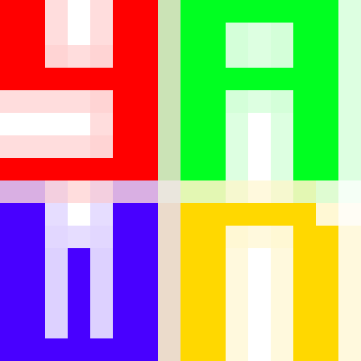
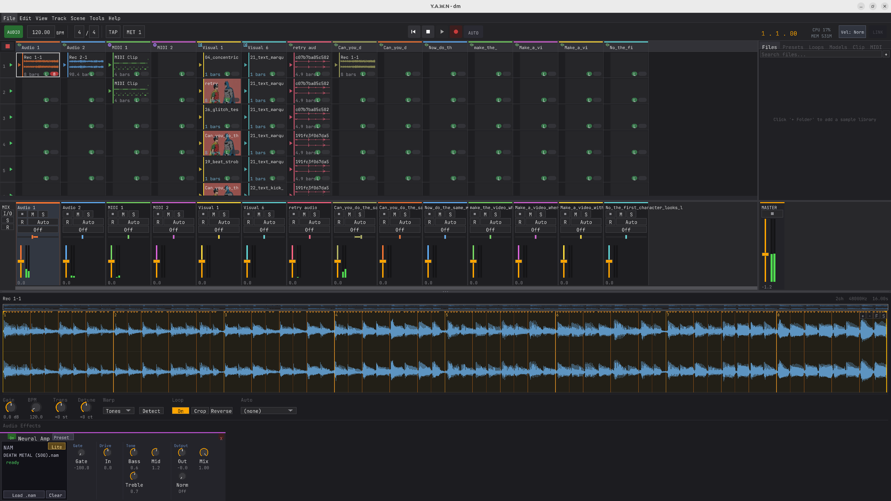
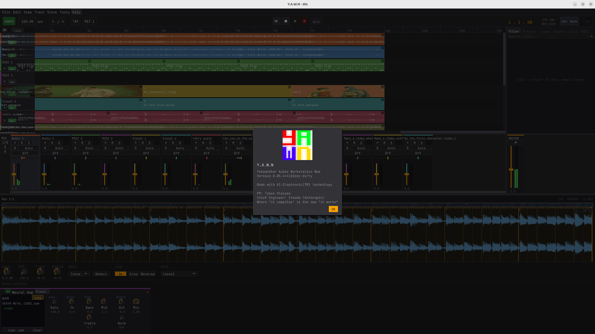
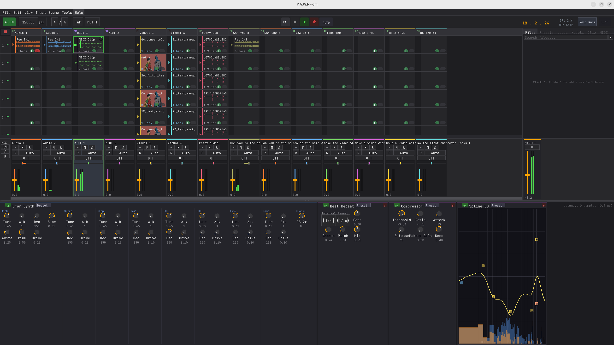
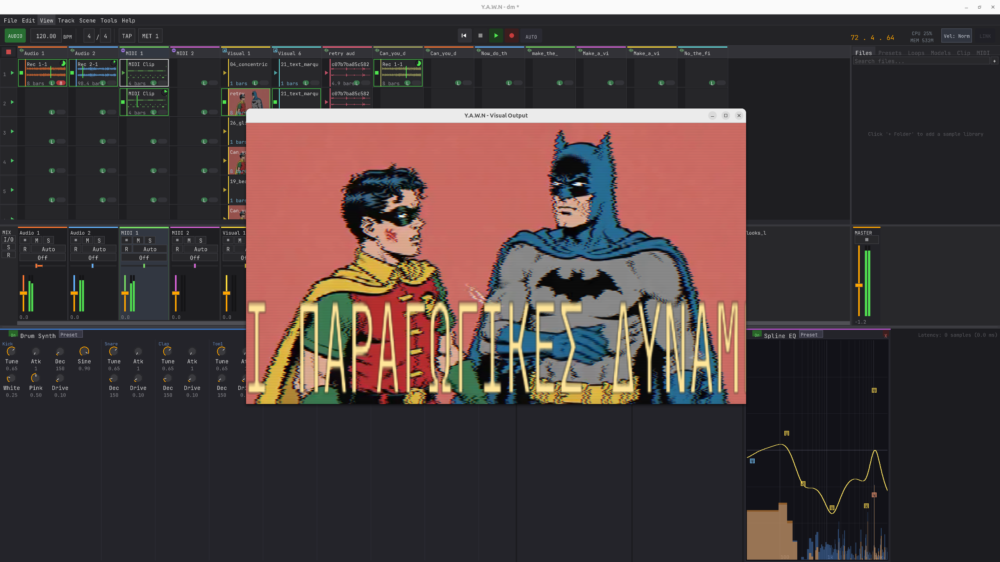
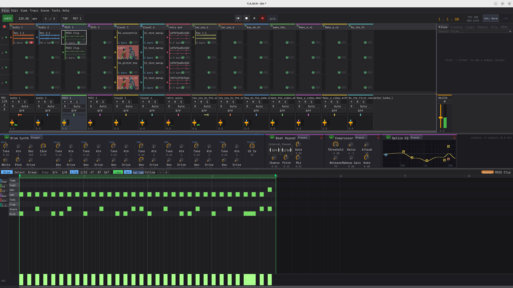

<p align="center">
  
</p>

<h1 align="center">Y.A.W.N</h1>
<h3 align="center">Yetanother Audio Workstation New</h3>

<p align="center">
  A cross-platform digital audio workstation inspired by Ableton Live.<br/>
  Session View · Arrangement · Mixer · VST3 · Instruments · Effects · MIDI · Recording · Automation · Presets · <strong>Ableton Link</strong> · Controller Scripting (Push 1 + Move + nanoKONTROL2 + Reface DX) · <strong>Visual / VJ Engine · Video Clips · 3D Models</strong> · <strong>Stem Separation · Audio→MIDI</strong><br/><br/>
  <em>Made with AI-Sloptronic™ technology</em><br/>
  <sub>Where "it compiles" is the new "it works", every bug is a ✨feature request✨, and every feature request is a ✨pre-existing bug✨</sub>
</p>

---

> **⚠️ Disclaimer:** No human engineers were mass-employed in the making of this software.
> The entire codebase was produced through the ancient art of describing what you want to a machine
> and then spending twice as long explaining why that's not what you meant.
> Side effects may include: spontaneous filter resonance, existential questions about who actually wrote this,
> and an unshakeable feeling that the AI is just gaslighting you into thinking the bug is fixed.
>
> **⚠️ VST3 Disclaimer:** We have successfully taught an AI to host third-party plugins inside a DAW
> that was itself written by an AI. This is either the future of music production or the opening scene
> of a techno-horror film. The VST3 editors run in a separate process because JUCE plugins install
> Win32 hooks that freeze our event loop — a bug we diagnosed after 3 hours of "why is the window frozen"
> followed by the AI saying "Ah, I see the issue!" for the 47th time.
>
> **⚠️ Ableton Link Disclaimer:** YAWN is now ABLE-TO-N (sync). Press Play in Live and YAWN follows.
> Press Play in YAWN and Live follows. Two AI-written DAWs and one AI-written DAW are now phase-locked
> over your LAN. We're not saying this is how Skynet starts but we're not NOT saying it.
>
> **⚠️ Neural Amp Disclaimer:** YAWN hosts WaveNet-style guitar amp captures inline via Neural Amp
> Modeler. The third model use-after-freed the audio thread on a freed `nam::DSP*` because the loader
> destroyed it from the UI thread mid-`process()`. The fix is RCU-lite atomic pointer swap with a
> retired-list and deferred destruction on the next load — the same trick we then wrote into
> Convolution Reverb because it had the same race waiting to bite.
>
> **⚠️ Stem-Separation Disclaimer:** YAWN can split a song into drums / bass / other / vocals with
> Meta's Demucs v4 — an AI that cannot hear the drums, extracting drums it will not hear, on a CPU,
> for five minutes. The ~170 MB model now ships bundled in the release downloads, so the app is
> self-contained and the AI can not-hear your stems the moment you unzip it.

## Highlights

A more-or-less complete Ableton-Live-shaped DAW, written by an AI that has never heard a sound.
The [full feature list lives in **docs/features.md**](docs/features.md) — the short tour:

- **Audio engine** — Lock-free real-time PortAudio thread (ASIO/WASAPI/ALSA), zero audio-thread allocations, quantized clip launching, follow actions, WSOLA + Phase Vocoder time-stretch, transient detection
- **64-track mixer** — Volume/pan/mute/solo + metering, 8 send/return buses, master, 3-point effect insert, sidechain + modulation routing
- **23 audio effects** — Reverb, Delay, Ping-Pong, EQ, Spline EQ, Compressor, Limiter, Filter, Chorus, Phaser, Wah, Rotary, Distortion, Bitcrusher, Noise Gate, Envelope Follower, **Convolution Reverb** (38 bundled IRs), **Neural Amp Modeler** (4 bundled `.nam` captures), Tape, Amp Sim, Tuner, Oscilloscope, Spectrum Analyzer
- **15 instruments** — Subtractive, FM, Sampler, Karplus-Strong, Wavetable, Granular, Vocoder, String Machine, Drawbar Organ, Electric Piano, Multisampler, Instrument Rack, Drum Rack, DrumSlop, Drum Synth
- **Auto-Sampler** — Build a Multisampler from any MIDI source (incl. WASAPI loopback on Windows — no VB-CABLE)
- **MIDI** — 16-bit velocity / 32-bit CC internals, MPE, 8 MIDI effects, MIDI Learn, MIDI monitor, ~2,600-loop factory library
- **Stem separation (Demucs v4)** & **Audio→MIDI (Basic Pitch)** — ONNX-Runtime audio analysis; the stem model ships bundled in releases
- **VST3 hosting** — Process-isolated plugin editors (Windows HWND + Linux X11 embed), parameter sync, state persistence
- **Session + Arrangement views** — Clip grid with scenes & follow actions; linear timeline with automation lanes, loop range, waveform display
- **Automation & modulation** — Breakpoint envelopes (Read/Touch/Latch), per-track LFOs with named-target picker (incl. visual params)
- **Ableton Link** — Drift-free LAN beat/tempo sync with Live, Logic, Bitwig, iOS apps
- **Controller scripting** — Lua 5.4 `yawn.*` API with auto-detection + hot reload; Push 1, Move, nanoKONTROL2, Reface DX
- **Visual / VJ engine** — Per-track GPU layers, Shadertoy-compatible hot-reload shaders, audio-reactive rendering, video import (ffmpeg) + live input, glTF 2.0 3D models with skeletal animation, Lua scene scripts, master post-FX, A–H knobs + automation
- **Single fw2 UI framework** — Cached two-pass layout, capture-stomp guards, DPI scaling, native menus, scrollable dialogs
- **Quality** — 1,360+ Google Test cases, zero audio-thread allocations, broken-code warnings promoted to compile errors

## Screenshots


*Session View — the clip grid with scenes across audio, MIDI and visual tracks, the mixer with live meters, and the audio-clip waveform editor below.*


*Arrangement View — audio, MIDI and visual clips laid out along the linear timeline, with automation lanes, loop range, and waveform display.*


*DrumSynth — a per-voice drum synthesizer (tune / attack / drive per voice) feeding a Beat Repeat → Compressor → Active EQ device chain.*


*Visual / VJ engine — the dedicated output window rendering an audio-reactive layer with a text overlay, driven live from the session alongside the device chain and EQ.*


*Piano roll & step editor — MIDI note editing with velocity lanes, sitting under the DrumSynth device chain.*

## Tech Stack

| Component | Technology |
|---|---|
| Language | C++17 |
| UI / Windowing | SDL3 + OpenGL 3.3 |
| Audio I/O | PortAudio |
| MIDI I/O | RtMidi 6.0 |
| Controller / Scene Scripting | Lua 5.4 (vendored, sandboxed) |
| Audio Files | libsndfile |
| Font / Image | stb_truetype / stb_image |
| Video Decode | libavcodec / libavformat / libswscale (optional); `ffmpeg` binary for import |
| Live Video | libavdevice (optional) |
| 3D Models (glTF 2.0) | tinygltf (optional) |
| Neural Amp Modelling | NeuralAmpModelerCore + Eigen (optional, C++20 static lib behind a PIMPL) |
| Stem Separation / Audio→MIDI | ONNX Runtime + Eigen — Demucs v4 + Spotify Basic Pitch (vendored MIT ports). On in official release builds; the Demucs model is bundled in the release package |
| Convolution / FFT | KissFFT (vendored fallback) |
| Build System | CMake 3.24+ |
| Testing | Google Test 1.14 |
| Platforms | Windows, Linux |

All dependencies are fetched automatically via CMake FetchContent — no manual installs needed. The AI insisted on this because it can't `apt-get` and refused to write installation instructions longer than 3 lines.

## Quick Start

**Just want to run it?** Grab a [release](https://github.com/tkleisas/yawn/releases) — the Windows `.zip` / Linux `.tar.gz` are self-contained (binary + ONNX Runtime + Demucs model + assets). Unpack and run.

**Building from source:**

```bash
pip install jinja2                                   # glad2 needs it
cmake -B build -DCMAKE_BUILD_TYPE=Release
cmake --build build --config Release
./build/bin/YAWN                                     # Windows: build\bin\Release\YAWN.exe
```

Full prerequisites (Linux dev packages, optional video/ONNX feature flags, how the
self-contained releases are built, and the stem-separation model) are in
**[docs/building.md](docs/building.md)**.

## Documentation

| Doc | What's in it |
|---|---|
| [docs/features.md](docs/features.md) | The full, exhaustive feature list |
| [docs/building.md](docs/building.md) | Prerequisites, build flags, releases, the stem model |
| [docs/controls.md](docs/controls.md) | Keyboard + mouse controls reference |
| [docs/architecture.md](docs/architecture.md) | System diagram, thread model, audio signal flow |
| [docs/project-structure.md](docs/project-structure.md) | Annotated source tree |
| [CHANGELOG.md](CHANGELOG.md) | Release history, implementation phases, lessons learned |
| [docs/visual.md](docs/visual.md) | Shader authoring, uniforms, video / live / 3D / Lua / automation |
| [docs/controller-scripting.md](docs/controller-scripting.md) | Lua API + every controller's button/CC map |
| [docs/ableton-move.md](docs/ableton-move.md) | Ableton Move button map, encoders, LED palette |
| [docs/ui-v2-architecture.md](docs/ui-v2-architecture.md) | fw2 UI framework internals ([events](docs/ui-v2-events.md), [layout](docs/ui-v2-measure-layout.md), [layer stack](docs/ui-v2-layer-stack.md), [theme](docs/ui-v2-theme.md)) |
| [docs/widgets/](docs/widgets/README.md) | Per-widget reference |
| [NOTICES.md](NOTICES.md) | Third-party content licenses + attribution |

## The Team

| Role | Entity | Responsibilities |
|---|---|---|
| **Project Manager** | Tasos Kleisas | Vision, QA, yelling "it still doesn't work", changing requirements mid-sentence, clicking things really fast to find bugs, discovering that resonance + fast cutoff sweep = pain |
| **Chief Engineer** | Claude (Anthropic) | Writing code, rewriting code, explaining why the code was wrong, rewriting it again, apologizing, "I see the issue!", writing commit messages longer than the actual fix |

```
while (true) {
    PM: "Add feature X"
    AI: *writes 200 lines*
    PM: "It doesn't work"
    AI: "Ah, I see the issue!" *rewrites 200 lines*
    PM: "Now Y is broken"
    AI: "Ah, I see the issue!" *rewrites 150 lines*
    PM: "OK it works. But..."
    AI: *sweating in tokens*
    PM: "...can we also—"
    AI: "Of course!"  // narrator: it could not
}
```

The 19 hard-won engineering war-stories ("It compiles ≠ It works", "Filter resonance is
the QA department", "The 100 MB file is always somewhere") now live in
**[CHANGELOG.md → Lessons learned](CHANGELOG.md#lessons-learned)**.

*This is what software development looks like in 2026. One human with opinions and one AI with infinite patience. The future is sloppy, it ships, the warnings are errors, the dials turn, and honestly? It kinda slaps.*

## License

[MIT](LICENSE.txt) © Tasos Kleisas
